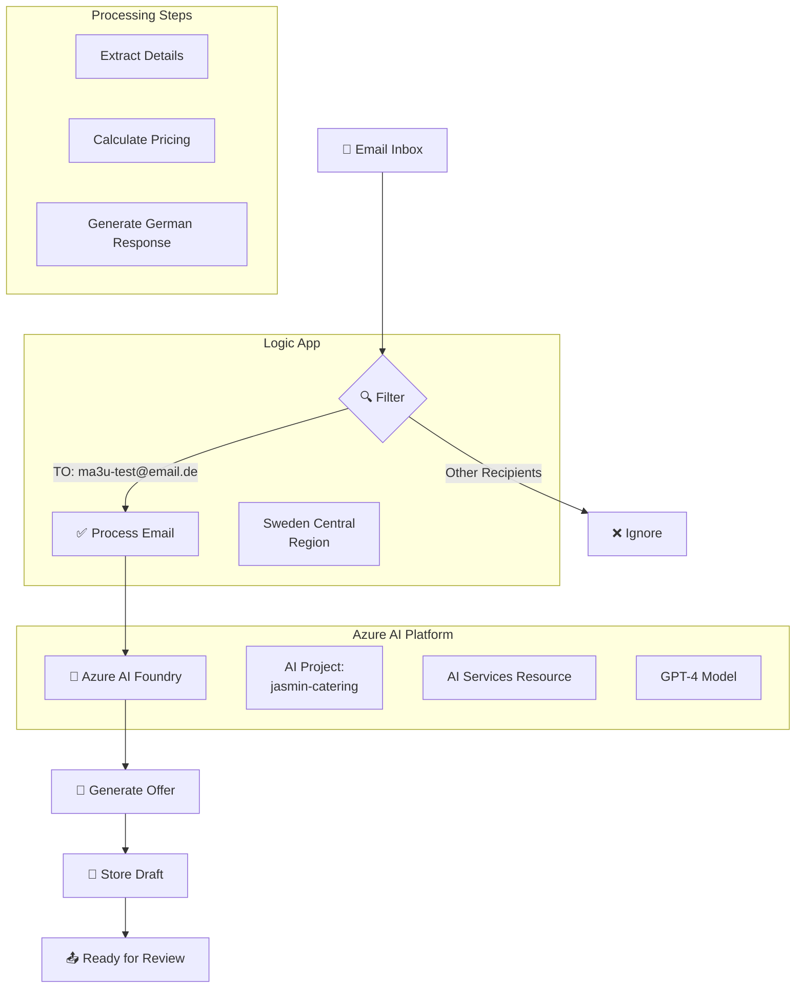

# 🍽️ Jasmin Catering AI Agent

## 🚀 **Current Implementation: Azure Logic Apps + AI Foundry**

Automated email processing system for Jasmin Catering - a Syrian fusion restaurant in Berlin. The system monitors emails sent to `ma3u-test@email.de`, generates professional catering offers in German using GPT-4 through Azure AI Foundry, and creates email drafts for review.

### ✅ **What's Working Now:**
- **Email Filtering**: Only processes emails sent TO `ma3u-test@email.de`
- **AI Processing**: Azure AI Foundry (GPT-4) for intelligent response generation
- **Automated Offers**: Calculates pricing based on guest count (35-45€/person)
- **German Templates**: Professional responses with Syrian fusion menu suggestions
- **Sweden Central Region**: Default deployment target due to Azure restrictions

---

## 📁 **Project Structure**

```
jasmin-catering-ai-agent/
├── README.md                       # This documentation
├── CLAUDE.md                       # Guide for future Claude instances
├── .env                           # Environment configuration (not in Git)
├── .gitignore                     # Git ignore rules
├── deployments/                   # All deployment assets
│   ├── scripts/                   # Deployment and utility scripts
│   │   ├── deploy-main.sh        # Main deployment script
│   │   ├── deploy-ai-foundry.sh  # AI Foundry deployment script
│   │   ├── load-env-config.sh    # Environment configuration loader
│   │   ├── monitor-logic-app.sh  # Monitoring script
│   │   └── send-test-email.sh    # Test email information script
│   ├── logic-apps/               # Logic App workflow definitions
│   │   └── email-processor-workflow.json
│   ├── terraform/                # Infrastructure as Code (Terraform)
│   │   ├── main.tf              # Main Terraform configuration
│   │   ├── variables.tf         # Variable definitions
│   │   ├── outputs.tf           # Output definitions
│   │   ├── logic_app_complete.tf # Complete Logic App deployment
│   │   ├── terraform.tfvars.example # Example variables file
│   │   ├── README.md            # Terraform documentation
│   │   └── .gitignore           # Terraform-specific ignores
│   └── templates/                # Email templates and examples
│       └── email-draft-example.md
└── docs/                         # Additional documentation
```

---

## 🏗️ **Architecture**



---

## 🚀 **Quick Start**

### **Prerequisites**
- Azure CLI installed (`brew install azure-cli`)
- Azure subscription with access
- `.env` file with required credentials

### **1. Clone & Configure**
```bash
git clone [repository-url]
cd jasmin-catering-ai-agent

# Create .env file with your credentials
cp .env.example .env
# Edit .env with your values
```

### **2. Deploy**
```bash
cd deployments/scripts
./deploy-main.sh
```

### **3. Monitor**
```bash
./monitor-logic-app.sh
```

---

## 🔧 **Deployment Options**

### **Option 1: Shell Scripts (Quick Start)**

| Script | Purpose | Usage |
|--------|---------|-------|
| `deploy-ai-foundry.sh` | Deploy with AI Foundry integration | `./deploy-ai-foundry.sh` |
| `deploy-main.sh` | Basic deployment script | `./deploy-main.sh` |
| `load-env-config.sh` | Loads environment configuration | Sourced by other scripts |
| `monitor-logic-app.sh` | Monitors Logic App runs | `./monitor-logic-app.sh` |
| `send-test-email.sh` | Shows test email configuration | `./send-test-email.sh` |

### **Option 2: Terraform (Infrastructure as Code)**

For production deployments, use the Terraform configuration in `deployments/terraform/`:

```bash
cd deployments/terraform

# Initialize Terraform
terraform init

# Copy and configure variables
cp terraform.tfvars.example terraform.tfvars
# Edit terraform.tfvars with your values

# Plan deployment
terraform plan

# Apply configuration
terraform apply
```

**Benefits of Terraform:**
- Declarative infrastructure definition
- State management and version control
- Easy rollback and disaster recovery
- Better team collaboration
- Modular and reusable code

See `deployments/terraform/README.md` for detailed Terraform documentation.

### **deploy-ai-foundry.sh**
- Deploys with Azure AI Foundry project configuration
- Tests AI endpoint connectivity
- Shows AI project links
- Includes detailed AI configuration info

### **deploy-main.sh**
- Creates resource group in Sweden Central
- Deploys Logic App with email filtering
- Basic AI integration setup
- Sets up recurrence trigger (5 minutes)

### **load-env-config.sh**
- Loads configuration from `.env`
- Sets Sweden Central as default region
- Validates required environment variables
- Exports configuration for other scripts

### **monitor-logic-app.sh**
- Shows latest Logic App runs
- Displays processing status
- Monitors email filtering results

---

## 📝 **Workflow Files**

### **email-processor-workflow.json**
Main Logic App workflow that:
1. Simulates email inbox with test emails
2. Filters emails by recipient (`ma3u-test@email.de`)
3. Sends filtered emails to AI for processing
4. Generates professional German responses
5. Stores email drafts with pricing

**Key Features:**
- Email filtering by TO field
- Batch processing support
- Error handling
- Status tracking

---

## 🤖 **AI Service: Azure AI Foundry with OpenAI Assistant**

We use **Azure AI Foundry** with OpenAI Assistant API for intelligent email processing:

### **Assistant Integration**
- **Assistant ID**: `asst_MN5PHipyHYPXyq3fENx7V20j`
- **Purpose**: Specialized catering inquiry processing
- **Language**: German (Deutsch)
- **Features**: Pre-configured knowledge, consistent formatting, conversation threads

### **How It Works**
1. **Thread Creation**: Each email creates a new conversation thread
2. **Message Processing**: Customer inquiry added to thread
3. **Assistant Run**: Assistant processes the inquiry with RAG
4. **Response Generation**: Professional German catering offer created
5. **Draft Storage**: Response saved with thread and run IDs

### **Assistant Configuration**
The assistant is configured with a comprehensive prompt and RAG knowledge base:

```bash
# Configure assistant with prompt and documents
python deployments/scripts/configure-assistant.py
```

This uploads:
- Business process documentation
- Complete menu catalog with prices
- Email templates and examples
- Company policies and terms

See `deployments/ASSISTANT_CONFIGURATION.md` for details.

### **Technical Details:**
- **AI Project**: jasmin-catering
- **Resource**: jasmin-catering-resource (AI Services)
- **API Version**: 2024-02-01
- **Endpoints Used**:
  - `/openai/threads` - Create conversation threads
  - `/openai/threads/{id}/messages` - Add messages
  - `/openai/threads/{id}/runs` - Execute assistant
  - `/openai/threads/{id}/messages` - Retrieve responses

### **Benefits of Assistant API**:
- **Context Preservation**: Maintains conversation history
- **Consistent Responses**: Pre-configured assistant personality
- **Thread Management**: Organized conversation tracking
- **Future Extensibility**: Easy follow-up message handling

For detailed Assistant API documentation, see: `deployments/ASSISTANT_API_INTEGRATION.md`

---

## 📧 **Email Processing Flow**

### **1. Email Reception & Filtering**
- Logic App checks for new emails every 5 minutes
- Filters emails by recipient: only processes emails sent TO `ma3u-test@email.de`
- Ignores all other emails (spam, newsletters, etc.)

### **2. AI-Powered Email Analysis**
The system sends filtered emails to Azure AI Foundry for analysis:

**AI extracts:**
- Event type (Firmenevent, Hochzeit, Geburtstag, etc.)
- Date and time of event
- Number of guests
- Location/venue
- Budget constraints
- Special requirements (vegetarian, allergies, etc.)
- Preferred cuisine style

### **3. Intelligent Response Generation**
Based on the analysis, AI generates a complete German response:

**Response includes:**
- Personal greeting using sender's name
- Reference to their specific inquiry
- Customized Syrian fusion menu suggestions
- Detailed pricing calculation:
  - Base price per person (35-45€)
  - Service fee (15%)
  - Total cost with tax
  - Required deposit (30%)
- Special accommodations for dietary requirements
- Clear next steps for booking

### **4. Draft Storage & Management**
Each generated response is stored as a draft:

```json
{
  "draftId": "draft-20250624-123456",
  "originalEmail": {
    "from": "kunde@example.com",
    "subject": "Catering Anfrage",
    "body": "Original inquiry text..."
  },
  "analysis": {
    "eventType": "Firmenevent",
    "guestCount": 50,
    "eventDate": "15. August 2025",
    "specialRequirements": ["vegetarisch"]
  },
  "draftResponse": {
    "to": "kunde@example.com",
    "subject": "Re: Catering Anfrage - Ihr Angebot von Jasmin Catering",
    "body": "Complete German response with offer..."
  },
  "status": "pending_review",
  "createdAt": "2025-06-24T12:34:56Z"
}
```

### **Complete Example Workflow:**

#### **1️⃣ Input Email (Received)**
```
From: kunde@example.com
To: ma3u-test@email.de
Subject: Catering Anfrage für Firmenevent

Guten Tag,

wir planen ein Firmenevent für unsere Mitarbeiter und benötigen Catering.

Details:
- Datum: 15. August 2025
- Anzahl Personen: 50
- Ort: Berlin-Mitte, Konferenzraum
- Zeit: 12:00 - 16:00 Uhr
- Budget: ca. 2.000 EUR

Wir hätten gerne ein Buffet mit syrischen Spezialitäten. 
Einige unserer Mitarbeiter sind Vegetarier.

Können Sie uns ein Angebot zusenden?

Mit freundlichen Grüßen,
Max Mustermann
Firma GmbH
```

#### **2️⃣ AI Analysis (Extracted Data)**
```json
{
  "eventType": "Firmenevent",
  "eventDate": "15. August 2025",
  "guestCount": 50,
  "location": "Berlin-Mitte, Konferenzraum",
  "timeframe": "12:00 - 16:00 Uhr",
  "budget": 2000,
  "cuisine": "Syrische Spezialitäten",
  "specialRequirements": ["Vegetarische Optionen"],
  "contactPerson": "Max Mustermann",
  "company": "Firma GmbH"
}
```

#### **3️⃣ Generated Email Draft**
```
To: kunde@example.com
Subject: Re: Catering Anfrage für Firmenevent - Ihr Angebot von Jasmin Catering

Sehr geehrter Herr Mustermann,

vielen Dank für Ihre Anfrage für Ihr Firmenevent am 15. August 2025. 
Wir freuen uns sehr, Ihnen unser Catering-Angebot präsentieren zu dürfen!

JASMIN CATERING - SYRISCHES BUSINESS BUFFET

Für Ihre 50 Gäste haben wir ein exquisites Menü zusammengestellt:

🥙 VORSPEISEN & MEZZE
- Hummus Classic & Hummus Beiruti (vegan)
- Baba Ghanoush (Auberginen-Creme, vegan)
- Muhammara (Walnuss-Paprika-Dip, vegan)
- Falafel mit Tahini-Sauce (vegan)
- Fattoush-Salat (vegan)
- Gefüllte Weinblätter (vegetarisch)

🍖 HAUPTGERICHTE
- Shawarma vom Hähnchen mit Knoblauch-Sauce
- Kafta (gewürzte Lammhackspieße)
- Maklube (umgedrehter Reis mit Gemüse, vegetarisch)
- Mousaka auf syrische Art

🍚 BEILAGEN
- Syrischer Gewürzreis
- Gegrilltes Gemüse der Saison
- Frisches Pita-Brot

🍮 DESSERTS
- Baklava (3 Sorten)
- Maamoul (Dattelkekse)

💰 IHR ANGEBOT:
- Business Buffet für 50 Personen: 1.750,00 €
- Servicegebühr (15%): 262,50 €
- GESAMTPREIS: 2.012,50 € inkl. MwSt.
- Anzahlung (30%): 603,75 €

✅ INKLUSIVLEISTUNGEN:
- Anlieferung nach Berlin-Mitte
- Professioneller Aufbau
- Hochwertiges Geschirr & Besteck
- Service-Personal für 4 Stunden
- Abbau und Reinigung

Ihr Budget von 2.000 EUR passt perfekt zu unserem Angebot. 
Die vegetarischen Optionen sind deutlich gekennzeichnet.

Gerne besprechen wir weitere Details telefonisch: +49 30 123 456 789

Mit kulinarischen Grüßen,
Ihr Jasmin Catering Team

www.jasmincatering.de
info@jasmincatering.de
```

#### **4️⃣ Stored Draft Object**
```json
{
  "draftId": "draft-20250624-143022-7891",
  "status": "ready_for_review",
  "createdAt": "2025-06-24T14:30:22Z",
  "originalEmail": { ... },
  "analysis": { ... },
  "draftResponse": { ... },
  "pricing": {
    "basePrice": 1750.00,
    "serviceFee": 262.50,
    "totalPrice": 2012.50,
    "deposit": 603.75,
    "pricePerPerson": 35.00
  }
}
```

---

## 🌍 **Region: Sweden Central**

**Default Region**: `swedencentral`

Due to Azure restrictions in West Europe, all deployments default to Sweden Central. This is configured in:
- `load-env-config.sh`: Sets default region
- `deploy-main.sh`: Forces Sweden Central
- Resource group: `logicapp-jasmin-sweden_group`

---

## 📊 **Monitoring & Testing**

### **Check Deployment Status:**
```bash
az logic workflow show \
  --resource-group logicapp-jasmin-sweden_group \
  --name jasmin-order-processor-sweden \
  --query state
```

### **View Recent Runs:**
```bash
./monitor-logic-app.sh
```

### **Test Email Processing:**
Since the Logic App uses a timer trigger and simulates emails, you can:

1. **View test email information:**
   ```bash
   ./deployments/scripts/send-test-email.sh
   ```
   This displays the test email configuration and monitoring instructions.

2. **Monitor Logic App runs (real-time):**
   ```bash
   # List recent runs
   az rest --method get \
     --uri "https://management.azure.com/subscriptions/$AZURE_SUBSCRIPTION_ID/resourceGroups/logicapp-jasmin-sweden_group/providers/Microsoft.Logic/workflows/jasmin-order-processor-sweden/runs?api-version=2019-05-01&\$top=5" \
     --query "value[0:5].{Name:name,Status:properties.status,StartTime:properties.startTime}" \
     --output table
   ```

3. **Check specific run details:**
   ```bash
   # Replace [RUN_ID] with actual run ID from above command
   az rest --method get \
     --uri "https://management.azure.com/subscriptions/$AZURE_SUBSCRIPTION_ID/resourceGroups/logicapp-jasmin-sweden_group/providers/Microsoft.Logic/workflows/jasmin-order-processor-sweden/runs/[RUN_ID]?api-version=2019-05-01"
   ```

### **Azure Portal:**
Direct link available after deployment

---

## 🔐 **Configuration (.env)**

Required environment variables:
```bash
# Azure
AZURE_SUBSCRIPTION_ID=your-subscription-id
AZURE_RESOURCE_GROUP=logicapp-jasmin-catering_group
AZURE_AI_API_KEY=your-api-key

# Email
WEBDE_EMAIL_ALIAS=ma3u-test@email.de
WEBDE_APP_PASSWORD=your-app-password
```

---

## 📚 **Templates**

### **email-draft-example.md**
Shows example of generated email drafts including:
- Professional German greeting
- Syrian menu details
- Pricing breakdown
- Next steps

---

## 🚨 **Important Notes**

1. **Email Filter**: Only processes emails sent TO `ma3u-test@email.de`
2. **Region**: Always uses Sweden Central (West Europe restricted)
3. **API Key**: Stored in `.env`, never in code
4. **Pricing**: Calculated at 35-45€ per person
5. **Language**: All customer communication in German

---

## 🛠️ **Troubleshooting**

### **Deployment Fails**
- Check Azure login: `az login`
- Verify subscription: `az account show`
- Ensure `.env` file exists with all variables

### **No Emails Processed**
- Verify email is sent TO `ma3u-test@email.de`
- Check Logic App is enabled
- Review filter conditions in workflow

### **AI Errors**
- Verify API key in `.env`
- Check endpoint URL format
- Ensure Cognitive Services resource exists

---

## 📈 **Next Steps**

1. **Production Email**: Migrate from test to `info@jasmincatering.com`
2. **IMAP Integration**: Replace simulation with real email monitoring
3. **Approval Workflow**: Add Teams/Slack approval before sending
4. **SMTP Sending**: Automated email responses

---

## 👥 **Contributing**

1. Check `CLAUDE.md` for AI assistant guidance
2. Follow existing code patterns
3. Test deployments in Sweden Central
4. Update documentation for changes

---

Built for Jasmin Catering - Syrian Fusion Cuisine in Berlin 🇸🇾🇩🇪