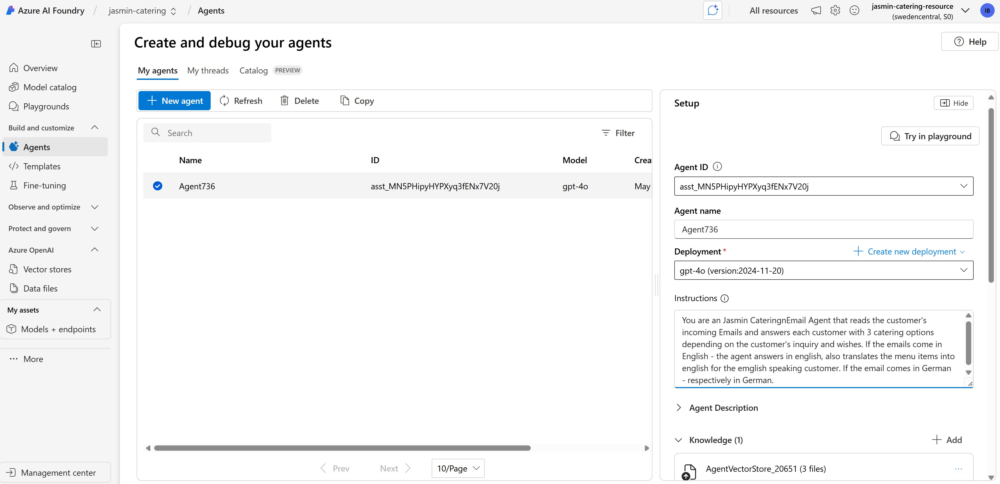
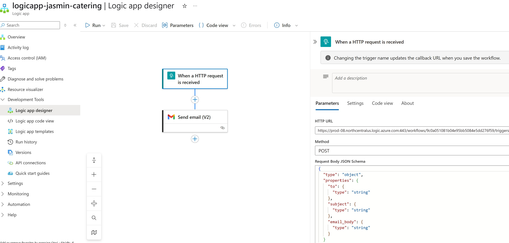
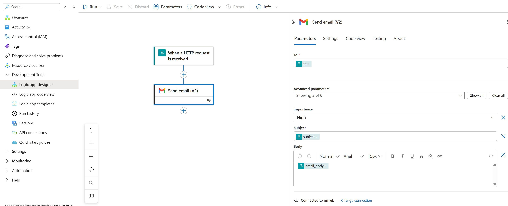
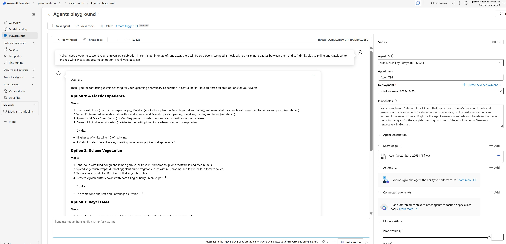

ENGLISH:

# ✨ Project: Jasmin Catering AI Agent Solution ✨

## 📝 Project Description

This project aims to automate and optimize the process of handling customer inquiries and creating offers for Jasmin Catering. Jasmin Catering is a family-run business in Berlin offering full-service catering for events with 15 to 500 guests, specializing in Syrian fusion cuisine. Currently, inquiries are captured via a form (website or Google Form). Based on the collected information (such as date, location, number of people, food preferences, budget, etc.), the caterer or potentially an agent creates and sends three different offers/packages via email. The proposed solution will utilize an AI agent to increase the efficiency and scalability of this inquiry and offer process. The agent should be capable of automatically generating offer suggestions from the inquiry information and supporting communication with the customer.

## 🎯 Goals

- **Accelerate Offer Creation:** Reducing the processing time from inquiry to dispatch of the offer. Currently, an offer is aimed to be sent within 72 hours.
- **Automate Routine Tasks:** Automatic extraction of relevant information from customer inquiries and generation of structured offer suggestions.
- **Improve Efficiency:** Enabling the processing of a larger number of inquiries without a proportional increase in manual effort.
- **Integration:** Seamless connection to existing or expandable inquiry forms (website form, Google Form).
- **Consistency:** Ensuring that offers and communication adhere to defined standards and templates.


## 🏗️ Scope

**In-Scope:**

- Capturing inquiry data from a provided form (Google Form or website form).
- Extraction and processing of key information from the inquiry (date, number of guests, location, food/drink preferences, dietary preferences like vegetarian/vegan, budget, etc.).
- Accessing a knowledge base with menu details, package structures, pricing information, and terms and conditions.
- Generation of drafts for three different offer variants ("3 Angebote / Packages") based on inquiry details and defined logic.
- Formatting the generated offers into an email that matches the template.
- Sending the offer email to the customer.
- Integration with the GPT-4o API as the chat model for natural language processing.

**Out-of-Scope (initial):**

- Full conversation with the customer throughout the entire booking process (e.g., clarifying details, changes after sending the offer, payment processing). The agent initially focuses on the first step: Inquiry -> Offer.
- Automatic invoicing after offer confirmation (this is currently handled separately).
- Complex negotiations or customized offers that significantly deviate from the predefined packages.
- Handling cancellations or changes less than 4 days before the event.
- Automatic follow-up on unconfirmed offers.


## 🤝 Key Stakeholders

- Jasmin Catering Management (Salma Armachi, Fadi Zaim)
- Customers of Jasmin Catering
- Development Team


## 🛠️ Required Technology \& Tools

- **AI Model:** GPT-4o API Key (as specified by the customer).
- **Platform for AI Agents/Workflow Automation:** Azure AI Foundry or n8n.
- **Database/Knowledge Base:** For storing structured data (menu details, prices, package rules, T\&Cs, etc.).
- **Email Service:** For reliable sending of emails (e.g., SendGrid, or a dedicated SMTP service).
- **Inquiry Capture:** Integration with Google Forms or the existing/expanded website form.


## 🇩🇪 Content Focus (German)

It is important to emphasize that, although the *description* and *technical planning* of the project in this documentation are in English, the AI agent's *interaction* with customers and the *content* of the generated offers and emails **will be in German**. The menu details and descriptions in the sources are also in German. The GPT-4o AI Agent must be able to understand German inquiries and respond and generate text fluently in German.

## 🤖 Technical Implementation Plans

Here are two possible plans for the technical implementation of the AI Agent solution:

---

### 1️⃣ Plan 1: Implementation with Azure AI Foundry (Focus on Agent Service \& RAG)

- **Platform:** Microsoft Azure, utilizing Azure AI Foundry services.
- **Concept:** Building an intelligent solution based on the Azure Cloud. The focus is on using the Azure AI Agent Service in combination with RAG to retrieve and utilize knowledge from a knowledge base.
- **Implementation Steps:**

1. **Inquiry Capture (Ingestion):** Configuration of an input trigger. This could be an Azure Function or Logic App that reacts to a new form submission (e.g., via Google Forms integration or webhook from the website form).
2. **Data Storage \& Knowledge Base:** Setting up a knowledge base. This can be a combination of Azure Blob Storage for documents (like T\&Cs, references) and a database like Azure SQL Database or Cosmos DB for structured data (menu items, prices, package definitions). This data is prepared for RAG, possibly using Azure AI Search (Indexing).
3. **Azure AI Agent Service:** Configuration and deployment of the main agent on Azure AI Foundry. This agent will be the orchestrator. It receives the inquiry information from the ingestion layer.
4. **Integration GPT-4o:** The Azure AI Agent is configured to use the GPT-4o API as the underlying large language model (LLM). GPT-4o is used to understand complex inquiries, process free text, and provide wording suggestions.
5. **Offer Logic (Offer Generation Logic):** Implementation of the logic that, based on the extracted inquiry data and by querying the knowledge base (via RAG over Azure AI Search), compiles the relevant menu items, quantities, and prices to calculate and structure the three offer variants. This logic can be implemented directly within the agent or in accompanying Azure Functions/Logic Apps.
6. **Email Generation \& Sending:** The generated offer text and details are formatted into the email template. An email service (e.g., via Azure Communication Services or SendGrid via Azure Marketplace) is called to send the email to the customer.
7. **Deployment \& Monitoring:** Deployment of services in Azure and setup of monitoring and logging to track agent activity and troubleshoot errors.


---

### 2️⃣ Plan 2: Implementation with n8n (Workflow Automation)

- **Platform:** n8n (Open Source Workflow Automation Tool, can be self-hosted or used as a cloud service).
- **Concept:** Building an automated workflow in n8n that connects various services via APIs.
- **Implementation Steps:**

1. **Inquiry Capture (Webhook/Node):** Configuration of an n8n Webhook Node or a specific Node (e.g., Google Forms Node) to capture incoming inquiries.
2. **Data Processing within the Workflow:** Use of various n8n Nodes (e.g., Function Nodes, JSON Nodes) to extract, clean, and structure the data from the form input.
3. **Data Storage (external DB/Sheet):** Storage of menu details, package structures, pricing rules, T\&Cs, etc., in an external database (e.g., PostgreSQL, MySQL) or a cloud sheet (Google Sheets, Airtable) that n8n can access via an appropriate Node.
4. **GPT-4o Integration:** Using an HTTP Request Node to call the GPT-4o API. The workflow can use GPT-4o to interpret free-text wishes or generate formulated text blocks for the offer. However, the core logic for selecting menu items and calculation is primarily based on the logic of the n8n workflow accessing the external knowledge base.
5. **Offer Logic within the Workflow:** Building the logic within the n8n workflow using Nodes like IF/ELSE, Function Nodes, Set Nodes, etc., to combine the inquiry data with information from the external data source and calculate and structure the three offers.
6. **Email Generation \& Sending:** Formatting the generated offer text and details into an email structure within the workflow. Using an n8n email Node (e.g., SMTP, SendGrid Node) to send the email in the template format.
7. **Deployment \& Monitoring:** Deployment of the n8n workflow (self-hosted or cloud) and use of n8n's internal monitoring functions.


---

### 3️⃣ Plan 3: Hybrid Approach (Optional / Quick Start)

- **Concept:** Starting with a simpler automation that covers only parts of the process.
- **Implementation Steps:** Focusing on automatically extracting the main inquiry data (number of guests, date, location) and using the GPT-4o API to generate a *raw draft* of an offer based on a simpler template and the extracted main data. This raw draft is then sent to the Jasmin Catering team for *manual review, adjustment, and finalization* before going to the customer. This reduces the automation goal but minimizes the complexity of the logic for the "3 Angebote / Packages" and allows for a quicker start. This could be a first step before moving to Plan 1 or 2.

---

## 🚀 Next Development Steps: Email Agent Integration

The next phase will extend the solution to include automated email handling capabilities, allowing the AI agent to read incoming customer emails and send automated responses directly through the existing Jasmin Catering email system.

### Email Agent Integration with Azure AI Foundry

To connect an email agent from Azure AI Foundry that can read incoming emails and send responses to customers using the 1\&1-hosted email (info@jasmincatering.com), three main components need integration:

- **Azure AI Foundry Agent Service** (for AI automation)
- **1\&1 (IONOS) email** (for receiving and sending emails)
- **Connector/integration logic** to bridge the email system and AI agent


#### Implementation Steps:

1. **Set Up Azure AI Foundry Agent Service**
    - Create an Azure AI Foundry resource and project in Azure subscription
    - Use Azure AI Foundry Agent Service to build and deploy an agent for text processing, response generation, and workflow automation
    - Customize the agent to handle email content, classify messages, and generate replies



2. **Configure Email Access (1\&1/IONOS)**
    - Configure standard email protocols to allow agent email access:
        - **IMAP/POP3:** For reading incoming emails
        - **SMTP:** For sending emails
    - **Typical 1\&1/IONOS Settings:**
        - SMTP server: `smtp.1and1.com` (Port: 587 TLS or 465 SSL)
        - IMAP server: `imap.1and1.com` (Port: 993 SSL)
        - Username: info@jasmincatering.com
3. **Integration Logic Implementation**
    - Implement middleware layer using Azure Functions, Logic Apps, or custom application:
        - Poll 1\&1 mailbox using IMAP for new emails
        - Forward email content to Azure AI Foundry Agent via API/SDK
        - Receive agent's generated response
        - Send response back to customer using SMTP
4. **Workflow Process**

5. New email arrives at info@jasmincatering.com
6. Integration logic detects email via IMAP
7. Email content sent to Azure AI Foundry Agent Service
8. Agent processes email and generates reply
9. Integration logic sends reply using SMTP
1. **Security \& Monitoring**
    - Store email credentials securely using Azure Key Vault
    - Implement Azure monitoring for agent performance and email flows
    - Ensure scalable, production-ready orchestration with built-in security

---

## 📧 Configure Email Access for Gmail (Testing Phase)

To connect your Azure AI Foundry agent to a Gmail address for testing, follow these detailed steps to ensure the agent can both read incoming emails and send responses.

### 1. Prepare Your Gmail Account

- Log in to your Gmail account via a web browser.
- Click the gear icon (⚙️) in the top right and select **See all settings**.
- Go to the **Forwarding and POP/IMAP** tab.
- In the **IMAP access** section, select **Enable IMAP**.
- Click **Save Changes** at the bottom of the page.


### 2. Allow Third-Party Access

- By default, Gmail may block less secure app access. For most modern integrations, you should use OAuth2 authentication.
- If you are using a script or app that does not support OAuth2, you may need to enable access for less secure apps (not recommended for production).
- For secure integration, create an **App Password** (if 2-Step Verification is enabled) or set up OAuth2 credentials in Google Cloud Console.

This approach ensures your agent can reliably interact with Gmail for development and testing.

---

## ⚙️ Configuring Gmail with Azure Logic Apps

Azure Logic Apps can be used to send emails dynamically by setting up a robust workflow that receives variable information and uses it to compose email content.

### Step 1: Create Azure Logic App Resource

- Navigate to the **Azure portal** and create a new Logic App resource
- Select a **blank logic app** to start from scratch
- Choose an appropriate resource group and location for your deployment


### Step 2: Configure HTTP Request Trigger

- Add a **"When a HTTP request is received" trigger** to initiate the logic app
- This trigger allows the logic app to be called by external APIs
- Set the HTTP method to **POST**
- A unique URL for API calls will be generated once the logic app is saved



### Step 3: Define Request Body Structure

For dynamic email content, configure the logic app to receive:

- **Recipient's email address** (`to`)
- **Email subject** (`subject`)
- **Email body content** (`email_body`)

**Best Practice:** Use the **"use sample payload" feature** with a JSON example:

```json
{
  "to": "customer@example.com",
  "subject": "Your Catering Offer",
  "email_body": "Dear customer, here is your personalized offer..."
}
```


This automatically generates the necessary payload definition for the HTTP trigger.

### Step 4: Add Gmail Connector

- Add a new step after the HTTP trigger
- Select the **Gmail connector** from available connectors
- Choose the **"Send email" action**


### Step 5: Establish Gmail Connection

- **First-time setup:** Provide a connection name and **sign in to your Gmail account**
- Grant the Logic App necessary permissions to send emails on your behalf
- The connection will be reused for future email sends


### Step 6: Configure Dynamic Email Fields

- In the "Send email" action, you'll see fields for "To," "Subject," and "Body"
- Use the **"Add Dynamic content" wizard** to populate these fields
- From the "When a HTTP request is received" section, **drag and drop**:
    - `to` property → "To" field
    - `subject` property → "Subject" field
    - `email_body` property → "Body" field
- Set additional parameters like "Importance" to static values (e.g., "High")


### Step 7: Testing and Implementation

- **Save the logic app** to generate the request URL
- **Copy the generated request URL** for testing
- Use tools like **Postman** to send POST requests with JSON payload:

```json
{
  "to": "test@example.com",
  "subject": "Test Email Subject",
  "email_body": "This is a test email with <br>line breaks and <b>HTML formatting</b>"
}
```

---

## 🧪 Testing the Agent

   

After configuring the system, the agent was tested with a real-world scenario:

**Test Query:**

> Hello, I need your help. We have an anniversary celebration in central Berlin on 29 of June 2025, there will be 30 persons, we need 4 meals with 30-45 minute pauses between them and soft drinks plus sparkling and classic white and red wine. Please suggest me an option. Thank you. Best, Ian

**Agent Response:**

> Dear Ian,
>
> Thank you for contacting Jasmin Catering for your upcoming anniversary celebration in central Berlin. Here are three tailored options for your event:
>
> **Option 1: A Classic Experience**
> - Humus with Love (our unique vegan recipe), Mutabal (smoked eggplant purée with yogurt and tahini), and marinated mozzarella with sun-dried tomatoes and pesto (vegetarian).
> - Vegan Kufta (mixed vegetable balls with tomato sauce) and Falafel cups with parsley, tomatoes, pickles, and tahini (vegetarian).
> - Spinach and Olive Burek (vegan) or Cup Veggies with mushrooms and carrots, with or without cheese.
> - Dessert: Mini cakes or Malakieh (pastries topped with pistachios, cashews, almonds - vegetarian).
>
> Drinks: 18 glasses of white wine, 12 of red wine. Soft drinks selection: still water, sparkling water, orange juice, and apple juice.
>
> **Option 2: Deluxe Vegetarian**
> - Lentil soup with fried dough and lemon garnish, or fresh mushrooms soup with mozzarella and fried humus.
> - Spiced vegetarian wraps: Mutabal eggplant purée, vegetable cups with mushrooms, and falafel balls in tomato sauce.
> - Warm spinach and olive Burek or Grilled vegetable bites.
> - Dessert: Agweh butter cookies with date filling or Berry Cream cups.
>
> Drinks: The same wine and soft drink offerings as Option 1.
>
> **Option 3: Royal Feast**
> - Finger food platters: mixed salads, Mutabal eggplant purée with tahini, and hummus spreads.
> - Hearty main course: Spiced vegetable wraps, mushroom-stuffed cups, and lentil-stuffed bread.
> - Warm dishes: Vegan kofta or spinach burek.
> - Dessert: Berry tartlets or Malakieh "Queen's Delight".
>
> Drinks: As per the prior offerings.
>
> If you'd like to mix-and-match components from each option or add extra servings, do let me know. We can also provide service personnel, table setups, and additional equipment as needed.
>
> Looking forward to your confirmation, and for any questions or customization requests, feel free to reach out!
>
> Best regards,
> [Your Name]
> Jasmin Catering Team

**Agent Testing Example:**

---

### Integrating the Azure AI Foundry Agent with Logic Apps Workflow

**1. Prerequisites**
* You have a Logic App (consumption SKU) that already connects to your Gmail inbox and can send emails.
* Your Azure AI Foundry agent is deployed and configured to generate catering offers based on incoming requests.
* Both resources are in the same Azure subscription/resource group, or you have the necessary permissions.
* You have the endpoint and authentication details for your Azure AI Foundry agent.

**2. Assign Permissions (RBAC)**
* In the Azure portal, go to your Logic App resource.
* Enable the **System Assigned Managed Identity** (under "Identity").
* Copy the **Object (principal) ID** of your Logic App.
* Go to your Azure AI Foundry project (where your agent is hosted).
* Under **Access control (IAM)**, add a role assignment:
   * Role: **Azure AI Project Manager** (or as required for agent invocation)
   * Assign it to the Logic App's principal ID.

**3. Update Your Logic App Workflow**

**A. Trigger: When a new email arrives (Gmail)**
* This is your existing trigger.

**B. Action: Call Azure AI Foundry Agent**
* Add a new step after the Gmail trigger.
* Use the **HTTP** action (or if available, the Azure AI Foundry Agent connector).
* Configure it to make a POST request to your agent's endpoint.
   * **URL**: Your agent's REST endpoint (from the Foundry project overview).
   * **Headers**: Include authentication (bearer token or resource key).
   * **Body**: Pass the relevant email content (subject, body, sender, etc.) as JSON.

Example JSON body:
```json
{
  "subject": "@{triggerOutputs()?['body/subject']}",
  "body": "@{triggerOutputs()?['body/body']}",
  "from": "@{triggerOutputs()?['body/from']}"
}
```
   * If using the official connector, map the fields as prompted.

**C. Action: Send Email with AI Reply**
* Add another step: **Send email (Gmail)**.
* In the "To" field, use the sender's email from the original message.
* In the "Body" and "Subject" fields, use the AI agent's response (from the previous HTTP action's output).

**4. Configure the Agent Tool in Foundry (Optional but Recommended)**
* In Azure AI Foundry, go to your agent's configuration.
* Add a new **Action** and select **Logic App** as the tool type.
* Register your Logic App workflow as a callable action for the agent, specifying the schema for the input/output as needed.
* This allows the agent to invoke the Logic App directly as part of its toolset, if you want more advanced orchestration.

**5. Test the End-to-End Flow**
* Send a catering inquiry email to your connected Gmail address.
* The Logic App should trigger, pass the email content to the AI agent, receive the generated catering offer, and reply to the sender automatically.

### Advanced Features
The `email_body` property supports **HTML formatting**, allowing for:
* **Line breaks** using `<br>` tags
* **HTML tables** using `<table>`, `<tr>`, and `<td>` tags
* **Rich formatting** with standard HTML tags for bold, italic, lists, etc.

This approach enables **highly flexible and formatted email generation** that can dynamically adapt to different customer inquiries and offer types.

## ⚠️ Important Notes

*   The **detailed structure of the "3 Angebote / Packages" and the associated price calculation rules** are essential for automated offer creation but are not fully documented in the provided sources. This is a critical requirement that must be precisely defined at the beginning of the project.
*   Integration with the **existing website form** depends on its technical nature. A Google Form generally offers simpler and standardized integration interfaces.
*   Information about the capabilities and setup of **Azure AI Foundry** and **n8n**, as well as general concepts of AI agents, RAG, and workflow automation, was drawn from my general knowledge and is **not directly contained in the provided sources**.

---

DEUTSCH:

# ✨ Projekt: Jasmin Catering AI Agent Lösung ✨

## 📝 Projektbeschreibung

Dieses Projekt zielt darauf ab, den Prozess der Bearbeitung von Kundenanfragen und der Erstellung von Angeboten für Jasmin Catering zu automatisieren und zu optimieren. Jasmin Catering ist ein familiengeführtes Unternehmen in Berlin, das Full-Service-Catering für Veranstaltungen mit 15 bis 500 Gästen anbietet, spezialisiert auf syrische Fusionsküche. Aktuell werden Anfragen über ein Formular (Website oder Google Form) erfasst. Basierend auf den gesammelten Informationen (wie Datum, Ort, Personenanzahl, Speisenwünsche, Budget etc.) werden vom Caterer oder potenziell einem Agenten drei verschiedene Angebote/Pakete erstellt und per E-Mail versendet. Die vorgeschlagene Lösung wird einen KI-Agenten nutzen, um die Effizienz und Skalierbarkeit dieses Anfrage- und Angebotsprozesses zu erhöhen. Der Agent soll in der Lage sein, aus den Anfrageinformationen automatisiert Angebotsvorschläge zu generieren und die Kommunikation mit dem Kunden zu unterstützen.

## 🎯 Ziele

*   **Beschleunigung der Angebotserstellung:** Reduzierung der Bearbeitungszeit von der Anfrage bis zum Versand des Angebots. Derzeit wird ein Angebot innerhalb von 72 Stunden angestrebt.
*   **Automatisierung von Routineaufgaben:** Automatisches Extrahieren relevanter Informationen aus Kundenanfragen und Generierung von strukturierten Angebotsvorschlägen.
*   **Verbesserung der Effizienz:** Ermöglichung der Bearbeitung einer größeren Anzahl von Anfragen ohne proportionalen Anstieg des manuellen Aufwands.
*   **Integration:** Nahtlose Anbindung an die bestehenden oder erweiterbaren Anfrageformulare (Website-Formular, Google Form).
*   **Konsistenz:** Sicherstellung, dass Angebote und Kommunikation den definierten Standards und Vorlagen entsprechen.

## 🏗️ Umfang

**In-Scope:**

*   Erfassung von Anfragedaten aus einem bereitgestellten Formular (Google Form oder Website-Formular).
*   Extraktion und Verarbeitung der Schlüsselinformationen aus der Anfrage (Datum, Gästezahl, Ort, Speisen-/Getränkewünsche, diätetische Präferenzen wie vegetarisch/vegan, Budget etc.).
*   Zugriff auf eine Wissensbasis mit Menüdetails, Paketstrukturen, Preisinformationen und Geschäftsbedingungen.
*   Generierung von Entwürfen für drei unterschiedliche Angebotsvarianten ("3 Angebote / Packages") basierend auf den Anfragedetails und der definierten Logik.
*   Formatierung der generierten Angebote in eine E-Mail, die der Vorlage entspricht.
*   Versand der Angebots-E-Mail an den Kunden.
*   Integration mit dem GPT-4o API als Chat-Modell für die Verarbeitung natürlicher Sprache.

**Out-of-Scope (initial):**

*   Vollständige Konversation mit dem Kunden über den gesamten Buchungsprozess (z.B. Klärung von Details, Änderungen nach Versand des Angebots, Zahlungsabwicklung). Der Agent konzentriert sich zunächst auf den ersten Schritt: Anfrage -> Angebot.
*   Automatische Rechnungsstellung nach Bestätigung des Angebots (dies wird derzeit separat gehandhabt).
*   Komplexe Verhandlungen oder maßgeschneiderte Angebote, die stark von den vordefinierten Paketen abweichen.
*   Handling von Absagen oder Änderungen weniger als 4 Tage vor der Veranstaltung.
*   Automatische Nachverfolgung unbestätigter Angebote.

## 🤝 Key Stakeholders

*   Jasmin Catering Management (Salma Armachi, Fadi Zaim)
*   Kunden von Jasmin Catering
*   Entwicklungsteam

## 🛠️ Benötigte Technologie & Tools

*   **KI-Modell:** GPT-4o API Key (wie vom Kunden angegeben).
*   **Plattform für KI-Agenten/Workflow-Automatisierung:** Azure AI Foundry oder n8n.
*   **Datenbank/Wissensbasis:** Zur Speicherung von strukturierten Daten (Menüdetails, Preise, Paketregeln, AGBs, etc.).
*   **E-Mail-Service:** Für den zuverlässigen Versand von E-Mails (z.B. SendGrid, oder ein dedizierter SMTP-Service).
*   **Anfrageerfassung:** Integration mit Google Forms oder dem bestehenden/erweiterten Website-Formular.

## 🇩🇪 Inhaltlicher Fokus (Deutsch)

Es ist wichtig zu betonen, dass, obwohl die *Beschreibung* und *technische Planung* des Projekts in dieser Dokumentation auf Englisch erfolgen, die *Interaktion* des KI-Agenten mit den Kunden und der *Inhalt* der generierten Angebote und E-Mails **auf Deutsch** sein werden. Die Menüdetails und Beschreibungen in den Quellen sind ebenfalls auf Deutsch. Der GPT-4o AI Agent muss in der Lage sein, deutsche Anfragen zu verstehen und flüssig auf Deutsch zu antworten und Texte zu generieren.

## 🤖 Technische Implementierungspläne

Hier werden zwei mögliche Pläne für die technische Umsetzung der KI-Agenten-Lösung vorgestellt:

### 1️⃣ Plan 1: Umsetzung mit Azure AI Foundry (Schwerpunkt Agent Service & RAG)

*   **Plattform:** Microsoft Azure, Nutzung der Azure AI Foundry Dienste.
*   **Konzept:** Aufbau einer intelligenten Lösung auf Basis der Azure Cloud. Der Fokus liegt auf der Nutzung des Azure AI Agent Service in Kombination mit RAG, um Wissen aus einer Wissensbasis abzurufen und nutzbar zu machen.
*   **Implementierungsschritte:**
    1.  **Anfrageerfassung (Ingestion):** Konfiguration eines Eingangs-Triggers. Dies könnte eine Azure Function oder eine Logic App sein, die auf eine neue Formularübermittlung (z.B. via Google Forms Integration oder Webhook vom Website-Formular) reagiert.
    2.  **Datenspeicherung & Wissensbasis (Knowledge Base):** Einrichten einer Wissensbasis. Dies kann eine Kombination aus Azure Blob Storage für Dokumente (wie AGBs, Referenzen) und einer Datenbank wie Azure SQL Database oder Cosmos DB für strukturierte Daten (Menüpunkte, Preise, Paketdefinitionen) sein. Diese Daten werden für RAG aufbereitet, möglicherweise unter Nutzung von Azure AI Search (Indexing).
    3.  **Azure AI Agent Service:** Konfiguration und Deployment des Hauptagenten auf Azure AI Foundry. Dieser Agent wird der Orchestrator. Er nimmt die Anfrageinformationen von der Ingestion-Schicht entgegen.
    4.  **Integration GPT-4o:** Der Azure AI Agent wird so konfiguriert, dass er die GPT-4o API als zugrundeliegendes großes Sprachmodell (LLM) nutzt. GPT-4o wird verwendet, um komplexe Anfragen zu verstehen, Freitext zu verarbeiten und Formulierungsvorschläge zu liefern.
    5.  **Angebotslogik (Offer Generation Logic):** Implementierung der Logik, die basierend auf den extrahierten Anfragedaten und durch Abfrage der Wissensbasis (via RAG über Azure AI Search) die relevanten Menüpunkte, Mengen und Preise zusammenstellt, um die drei Angebotsvarianten zu kalkulieren und zu strukturieren. Diese Logik kann direkt im Agenten oder in begleitenden Azure Functions/Logic Apps implementiert werden.
    6.  **E-Mail-Generierung & Versand:** Der generierte Angebotstext und die Details werden in die E-Mail-Vorlage formatiert. Ein E-Mail-Dienst (z.B. über Azure Communication Services oder SendGrid via Azure Marketplace) wird aufgerufen, um die E-Mail an den Kunden zu versenden.
    7.  **Deployment & Monitoring:** Bereitstellung der Dienste in Azure und Einrichtung von Monitoring und Logging zur Überwachung der Agentenaktivität und Fehlersuche.

### 2️⃣ Plan 2: Umsetzung mit n8n (Workflow Automatisierung)

*   **Plattform:** n8n (Open Source Workflow Automation Tool, kann selbst gehostet oder als Cloud-Dienst genutzt werden).
*   **Konzept:** Aufbau eines automatisierten Workflows in n8n, der verschiedene Dienste über APIs miteinander verbindet.
*   **Implementierungsschritte:**
    1.  **Anfrageerfassung (Webhook/Node):** Konfiguration eines n8n Webhook Nodes oder eines spezifischen Nodes (z.B. Google Forms Node), um eingehende Anfragen zu erfassen.
    2.  **Datenverarbeitung im Workflow:** Nutzung verschiedener n8n Nodes (z.B. Function Nodes, JSON Nodes) zur Extraktion, Bereinigung und Strukturierung der Daten aus dem Formularinput.
    3.  **Datenhaltung (externe DB/Sheet):** Speicherung von Menüdetails, Paketstrukturen, Preisregeln, AGBs etc. in einer externen Datenbank (z.B. PostgreSQL, MySQL) oder einem Cloud-Sheet (Google Sheets, Airtable), auf die n8n per entsprechendem Node zugreifen kann.
    4.  **GPT-4o Integration:** Verwendung eines HTTP Request Nodes, um die GPT-4o API aufzurufen. Der Workflow kann GPT-4o nutzen, um Freitext-Wünsche zu interpretieren oder formulierte Textbausteine für das Angebot zu erstellen. Die Kernlogik zur Auswahl der Menüpunkte und Kalkulation basiert jedoch primär auf der Logik des n8n Workflows, der auf die externe Wissensbasis zugreift.
    5.  **Angebotslogik im Workflow:** Aufbau der Logik innerhalb des n8n Workflows mit Nodes wie IF/ELSE, Function Nodes, Set Nodes etc., um die Anfragedaten mit den Informationen aus der externen Datenquelle zu kombinieren und die drei Angebote zu kalkulieren und zu strukturieren.
    6.  **E-Mail-Generierung & Versand:** Formatierung des generierten Angebotstextes und der Details in eine E-Mail-Struktur innerhalb des Workflows. Nutzung eines n8n E-Mail Nodes (z.B. SMTP, SendGrid Node) zum Versenden der E-Mail im Format der Vorlage.
    7.  **Deployment & Monitoring:** Bereitstellung des n8n Workflows (Self-hosted oder Cloud) und Nutzung der n8n internen Monitoring-Funktionen.

### 3️⃣ Plan 3: Hybrider Ansatz (Optional / Starthilfe)

*   **Konzept:** Beginn mit einer einfacheren Automatisierung, die nur Teile des Prozesses abdeckt.
*   **Implementierungsschritte:** Fokussierung auf die automatische Extraktion der Hauptanfragedaten (Gästezahl, Datum, Ort) und Nutzung der GPT-4o API, um einen *Rohentwurf* eines Angebots zu generieren, der auf einer simpleren Vorlage und den extrahierten Hauptdaten basiert. Dieser Rohentwurf wird dann an das Jasmin Catering Team zur *manuellen Überprüfung, Anpassung und Fertigstellung* gesendet, bevor er an den Kunden geht. Dies reduziert das Automatisierungsziel, minimiert aber die Komplexität der Logik für die "3 Angebote / Packages" und erlaubt einen schnelleren Start. Dies könnte ein erster Schritt sein, bevor zu Plan 1 oder 2 übergegangen wird.

## 🚀 Nächste Entwicklungsschritte: E-Mail-Agent Integration

Die nächste Phase wird die Lösung um automatisierte E-Mail-Bearbeitungsfunktionen erweitern, wodurch der KI-Agent eingehende Kunden-E-Mails lesen und automatisierte Antworten direkt über das bestehende Jasmin Catering E-Mail-System senden kann.

### E-Mail-Agent Integration mit Azure AI Foundry

Um einen E-Mail-Agenten von Azure AI Foundry zu verbinden, der eingehende E-Mails lesen und Antworten an Kunden über die 1&1-gehostete E-Mail (info@jasmincatering.com) senden kann, müssen drei Hauptkomponenten integriert werden:

* **Azure AI Foundry Agent Service** (für KI-Automatisierung)
* **1&1 (IONOS) E-Mail** (zum Empfangen und Versenden von E-Mails)
* **Connector/Integrationslogik** zur Verbindung von E-Mail-System und KI-Agent

### Implementierungsschritte:

**1. Azure AI Foundry Agent Service einrichten**
* Azure AI Foundry Ressource und Projekt in Azure-Abonnement erstellen
* Azure AI Foundry Agent Service nutzen zum Aufbau und Deployment eines Agenten für Textverarbeitung, Antwortgenerierung und Workflow-Automatisierung
* Agent anpassen für E-Mail-Inhaltsbearbeitung, Nachrichtenklassifizierung und Antwortgenerierung

**2. E-Mail-Zugang konfigurieren (1&1/IONOS)**
Standard-E-Mail-Protokolle konfigurieren für Agent-E-Mail-Zugang:
* **IMAP/POP3**: Zum Lesen eingehender E-Mails
* **SMTP**: Zum Versenden von E-Mails

**Typische 1&1/IONOS Einstellungen:**
* SMTP-Server: `smtp.1and1.com` (Port: 587 TLS oder 465 SSL)
* IMAP-Server: `imap.1and1.com` (Port: 993 SSL)
* Benutzername: info@jasmincatering.com

**3. Integrationslogik implementieren**
Middleware-Schicht mit Azure Functions, Logic Apps oder benutzerdefinierter Anwendung implementieren:
* 1&1-Postfach über IMAP auf neue E-Mails abfragen
* E-Mail-Inhalt an Azure AI Foundry Agent über API/SDK weiterleiten
* Generierte Antwort des Agenten empfangen
* Antwort über SMTP an Kunden zurücksenden

**4. Workflow-Prozess**
1. Neue E-Mail trifft bei info@jasmincatering.com ein
2. Integrationslogik erkennt E-Mail über IMAP
3. E-Mail-Inhalt an Azure AI Foundry Agent Service gesendet
4. Agent verarbeitet E-Mail und generiert Antwort
5. Integrationslogik sendet Antwort über SMTP

**5. Sicherheit & Monitoring**
* E-Mail-Zugangsdaten sicher mit Azure Key Vault speichern
* Azure-Monitoring für Agent-Performance und E-Mail-Flows implementieren
* Skalierbare, produktionsreife Orchestrierung mit integrierter Sicherheit gewährleisten

## ⚠️ Wichtige Hinweise

*   Die **detaillierte Struktur der "3 Angebote / Packages" und die zugehörigen Preiskalkulationsregeln** sind für die automatisierte Angebotserstellung essentiell, aber in den bereitgestellten Quellen nicht vollständig dokumentiert. Dies ist eine kritische Anforderung, die zu Beginn des Projekts genau definiert werden muss.
*   Die Integration mit dem **bestehenden Website-Formular** hängt von dessen technischer Beschaffenheit ab. Ein Google Form bietet in der Regel einfachere und standardisierte Integrationsschnittstellen.
*   Informationen über die Fähigkeiten und die Einrichtung von **Azure AI Foundry** und **n8n** sowie allgemeine Konzepte von AI-Agenten, RAG und Workflow-Automatisierung wurden meinem allgemeinen Wissen entnommen und sind nicht direkt in den bereitgestellten Quellen enthalten.

---