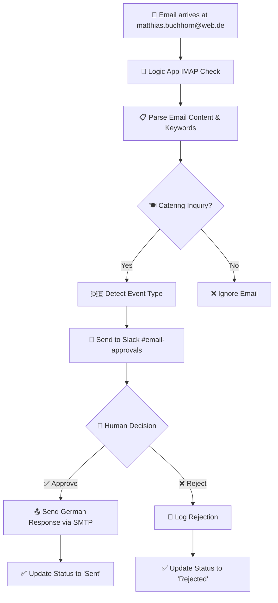

# 🍽️ Jasmin Catering AI Agent

## 🚀 **Current Status: Web.de Logic Apps Integration Ready**

Automated catering inquiry processing system for Jasmin Catering - a Syrian fusion restaurant in Berlin specializing in events with 15-500 guests.

### ✅ **What's Working Now:**
- **Web.de Email Monitoring**: Automatic IMAP monitoring for `matthias.buchhorn@web.de` (test) / `info@jasmincatering.com` (production)
- **Logic Apps Workflow**: Complete email processing with German catering inquiry detection
- **Slack Approval System**: Real-time notifications to `#email-approvals` in `mabured.slack.com`
- **German Response Templates**: Professional templates for Hochzeit, Firmenevent, Geburtstag, and general inquiries
- **SMTP Email Sending**: Automated German responses via web.de SMTP
- **Syrian Fusion Context**: Authentic menu descriptions and pricing in German

---

## 📁 **Project Structure**

```
/Users/ma3u/projects/jasmin-catering-ai-agent/
├── README.md                          # This documentation
├── azure.yaml                         # Azure Developer CLI configuration
├── .gitignore                         # Git ignore rules
├── LAST_UPDATED                       # Last backup timestamp
├── config/
│   └── azure-resources.json           # Azure resource configuration
├── logicapp/
│   ├── webde-approval-workflow.json   # Slack approval & SMTP sending workflow
│   └── workflow-parameters.json       # Generated during deployment
├── scripts/
│   ├── deploy-webde-logicapps.sh      # Main web.de deployment script ⚙️
│   ├── test-webde-emails.sh           # Email test templates 🧪
│   └── backup-to-github.sh            # GitHub backup automation 💾
├── docs/
│   ├── webde-testing-guide.md         # Comprehensive testing instructions
│   └── deployment-guide.md            # Detailed setup instructions
└── azure-functions/                   # Legacy Azure Functions (archived)
    └── [Previous implementation files]
```

---

## 🚀 **Quick Start Guide**

### **1. Deploy the Web.de Logic Apps** 
```bash
cd /Users/ma3u/projects/jasmin-catering-ai-agent
./scripts/deploy-webde-logicapps.sh
```

### **2. Configure Email Connections**
After deployment, update in Azure Portal:
- **IMAP Connection**: Enter web.de password for matthias.buchhorn@web.de
- **SMTP Connection**: Enter web.de password for matthias.buchhorn@web.de
- **Slack Bot Token**: Update Logic App parameter with your bot token

### **3. Create Slack Approval Channel**
In mabured.slack.com workspace:
```bash
/create #email-approvals
/invite @YasminCatering
```

### **4. Test with Email Templates**
```bash
./scripts/test-webde-emails.sh
# Copy and send test emails to matthias.buchhorn@web.de
```

### **5. Monitor & Approve**
Check #email-approvals channel for notifications and click approval buttons.

---

## 📧 **Email Processing Workflow**



### **Slack Approval Message Format:**
```
🍽️ Neue Catering-Anfrage von Web.de

Von: customer@example.com
Betreff: Hochzeit Catering für 120 Gäste

Event-Typ: Hochzeit
Email-ID: msg-12345...

Original-Anfrage:
```
Hallo, wir heiraten am 15. August 2025...
```

[✅ Antworten] [❌ Ignorieren]
```

---

## 🇩🇪 **German Response Templates**

### **Template Types:**
1. **🌟 Hochzeit (Wedding)** - Royal Wedding Package, Garden Celebration, Veggie Fusion
2. **💼 Firmenevent (Corporate)** - Business Premium, Business Lunch, Healthy & Veggie  
3. **🎂 Geburtstag (Birthday)** - Party Deluxe, Family Celebration, Kids & Adults
4. **🍽️ Allgemeine Veranstaltung (General)** - Classic Package, Vegetarian Delight, Premium Experience

### **Sample Wedding Response (German):**
```german
Liebe Brautleute,

vielen Dank für Ihre Anfrage für Ihr Hochzeit-Catering.

Als spezialisiertes syrisches Fusion-Catering freuen wir uns, 
Ihnen unsere exklusiven Hochzeitspakete anzubieten:

🌟 ROYAL WEDDING PACKAGE (52€/Person)
• Humus with Love - 3 authentische Variationen
• Malakieh "Die Königin" - exklusive Dessert-Station
• Warme syrische Hauptgerichte mit Fleisch & vegetarisch
• Vollservice: Aufbau, Service-Personal & Abbau

✨ ALLE PAKETE BEINHALTEN:
✅ Kostenlose Lieferung in Berlin & Umgebung
✅ Professioneller Aufbau am Veranstaltungsort
✅ 4 Stunden Service-Personal
✅ Hochwertiges Geschirr, Besteck & Dekoration

Mit herzlichen Grüßen und den besten Wünschen für Ihre Hochzeit,
Das Jasmin Catering Team

📞 +49 173 963 1536
🌐 www.jasmincatering.com
📧 info@jasmincatering.com

P.S: Als Familienunternehmen mit syrischen Wurzeln bringen wir 
authentische orientalische Aromen mit Berliner Kreativität auf 
Ihren besonderen Tag! 🇸🇾❤️🇩🇪
```


---

## 🏗️ **Architecture: Azure AI Foundry Implementation**

### **Implementation Plan: Azure AI Foundry + RAG**

**Platform:** Microsoft Azure, utilizing Azure AI Foundry services for intelligent automation.

**Concept:** Building an AI-powered solution based on Azure Cloud, focusing on the Azure AI Agent Service combined with RAG (Retrieval-Augmented Generation) to retrieve and utilize knowledge from our Syrian fusion catering knowledge base.

### **Phase 1: Current - Email Processing Pipeline** ✅
- **Azure LogicApps**: Email monitoring and Slack notifications
- **1und1 and web.de**: Email ingestion (`matthias.buchhorn@web.de`)
- **GitHub**: Version control and automated backups

### **Phase 2: AI Agent Integration** 🔄
- **Azure AI Foundry Agent Service**: Main orchestration and intelligence
- **Azure AI Search**: RAG-enabled knowledge base indexing
- **GPT-4o Integration**: Natural language processing for German communication
- **Azure Functions**: Supporting logic for offer calculations

### **Phase 3: Knowledge Base & RAG** 🔄
- **Azure Blob Storage**: Documents (T&Cs, references, menu descriptions)
- **Azure SQL Database**: Structured data (menu items, prices, package definitions)
- **Azure AI Search**: Indexing for RAG queries
- **Knowledge Management**: Syrian fusion specialties, pricing logic, German templates

### **Phase 4: Production Automation** 🔄
- **Azure Communication Services**: Professional email sending
- **Azure Monitor**: Logging and performance tracking
- **Azure Key Vault**: Secure credential management
- **Production Email**: Migration to `info@jasmincatering.com`

# 🔧 **Developer Section: AI Foundry Order Processing**

## **Latest Implementation (June 2025)**

### **Current Status** ✅
- **Deployed**: June 23, 2025
- **Logic App**: `jasmin-order-processor` (North Europe)  
- **Email**: `ma3u-test@email.de`
- **AI**: Azure AI Foundry (GPT-4)
- **Automation**: Full CLI deployment (no manual steps)

### **Quick Deployment** 🚀

```bash
# Navigate to project
cd jasmin-catering-ai-agent/ai-foundry-email-processor

# Run automated deployment (no manual steps!)
./scripts/deploy-complete.sh
```

**That's it!** The script will:
- Load credentials from `.env`
- Deploy Logic App to North Europe
- Configure AI integration
- Set up email monitoring

### **Testing & Monitoring** 🧪

```bash
# Check deployment status
az logic workflow show \
  --resource-group logicapp-jasmin-catering_group \
  --name jasmin-order-processor \
  --query state

# Monitor runs
az logic workflow run list \
  --resource-group logicapp-jasmin-catering_group \
  --name jasmin-order-processor \
  --output table

# Test email
# Send to: ma3u-test@email.de
# Subject: "Catering Anfrage"
```

### **Key Features** 🌟

- **Automated Deployment**: Single script deployment with `deploy-complete.sh`
- **Region**: North Europe (West Europe restricted)
- **Email Alias**: `ma3u-test@email.de` for testing
- **AI Integration**: Azure AI Foundry with GPT-4
- **Security**: All secrets in `.env` file (never in code)
- **Monitoring**: Built-in Azure logging

### **Architecture** 🏗️

```
┌─────────────────┐     ┌──────────────────┐     ┌─────────────────┐
│ ma3u-test@      │────▶│  Logic Apps      │────▶│  AI Foundry     │
│ email.de        │     │  (North Europe)  │     │  (GPT-4)        │
└─────────────────┘     └──────────────────┘     └─────────────────┘
        ↑                      │                           │
        │                      ▼                           ▼
   Test Email           ┌──────────────────┐     ┌─────────────────┐
                        │  Workflow Logs   │     │  AI Processing  │
                        └──────────────────┘     └─────────────────┘
```

### **Important Notes** ⚠️

- **Region**: Always use `northeurope` - West Europe has restrictions
- **Secrets**: Never commit `.env` file to Git
- **Email**: Only processes emails sent TO `ma3u-test@email.de`
- **API Key**: Stored in `.env` as `AZURE_AI_API_KEY`

### **Next Steps** 📈

1. **Add Email Trigger**: Implement real IMAP monitoring
2. **Teams Integration**: Add approval workflow
3. **SMTP Response**: Send automated responses
4. **Production**: Move to `info@jasmincatering.com`

### **Documentation** 📚

- [AI Foundry README](ai-foundry-email-processor/README.md)
- [Automated Deployment Guide](ai-foundry-email-processor/AUTOMATED_DEPLOYMENT.md)
- [Security Best Practices](ai-foundry-email-processor/SECURITY.md)

## **Current Implementation Overview**
