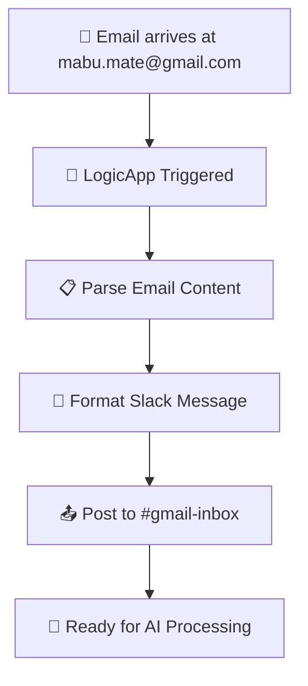

# 🍽️ Jasmin Catering AI Agent

## 🚀 **Current Status: LogicApp Email-to-Slack Integration Ready**

Automated catering inquiry processing system for Jasmin Catering - a Syrian fusion restaurant in Berlin specializing in events with 15-500 guests.

### ✅ **What's Working Now:**
- **Email Monitoring**: Automatic Gmail monitoring for `mabu.mate@gmail.com`
- **Slack Integration**: Real-time notifications to `#gmail-inbox` in `mabured.slack.com`
- **Structured Workflow**: Complete LogicApp workflow for email processing
- **Azure Deployment**: Ready-to-deploy scripts with proper authentication
- **Version Control**: GitHub integration with automatic backups

---

## 📁 **Project Structure**

```
/Users/ma3u/projects/jasmin-catering-ai-agent/
├── README.md                          # This documentation
├── azure.yaml                         # Azure Developer CLI configuration
├── .gitignore                         # Git ignore rules
├── LAST_UPDATED                       # Last backup timestamp
├── config/
│   └── azure-resources.json           # Azure resource configuration
├── logicapp/
│   ├── workflow-definition.json       # Complete LogicApp workflow
│   └── workflow-parameters.json       # Generated during deployment
├── scripts/
│   ├── deploy-logicapp.sh             # Main deployment script ⚙️
│   └── backup-to-github.sh            # GitHub backup automation 💾
└── docs/
    └── deployment-guide.md            # Detailed setup instructions
```

---

## 🚀 **Quick Start Guide**

### **1. Deploy the LogicApp** 
```bash
cd /Users/ma3u/projects/jasmin-catering-ai-agent
./scripts/deploy-logicapp.sh
```

### **2. Authorize OAuth Connections**
After deployment, the script provides direct Azure Portal links:
- **Gmail Connection**: Authorize with `mabu.mate@gmail.com`
- **Slack Connection**: Authorize with `mabured.slack.com` workspace

### **3. Test the Integration**
```bash
# Send test email to trigger workflow
# Check #gmail-inbox channel in Slack workspace
# Expected: Formatted message with email details
```

### **4. Backup Configuration**
```bash
./scripts/backup-to-github.sh
```

---

## 📧 **Email Processing Workflow**


```mermaid
graph TD
    A[📧 Email arrives at mabu.mate@gmail.com] --> B[🔄 LogicApp Triggered]
    B --> C[📋 Parse Email Content]
    C --> D[💬 Format Slack Message]
    D --> E[📤 Post to #gmail-inbox]
    E --> F[🤖 Ready for AI Processing]
```

### **Slack Message Format:**
```
📧 New Email for Jasmin Catering
From: customer@example.com
Subject: Wedding catering inquiry for 150 guests
Received: 2025-06-20T14:30:00Z
Email ID: abc123...

Preview: Hello, we need catering for 150 guests on March 15th...

🤖 Next Steps: This email will be processed by the Jasmin Catering AI Agent
```

---

## 🏗️ **Architecture: Azure AI Foundry Implementation**

### **Implementation Plan: Azure AI Foundry + RAG**

**Platform:** Microsoft Azure, utilizing Azure AI Foundry services for intelligent automation.

**Concept:** Building an AI-powered solution based on Azure Cloud, focusing on the Azure AI Agent Service combined with RAG (Retrieval-Augmented Generation) to retrieve and utilize knowledge from our Syrian fusion catering knowledge base.

### **Phase 1: Current - Email Processing Pipeline** ✅
- **Azure LogicApps**: Email monitoring and Slack notifications
- **Gmail API**: Email ingestion (`mabu.mate@gmail.com`)
- **Slack API**: Team notifications (`mabured.slack.com`)
- **GitHub**: Version control and automated backups

### **Phase 2: AI Agent Integration** 🔄
- **Azure AI Foundry Agent Service**: Main orchestration and intelligence
- **Azure AI Search**: RAG-enabled knowledge base indexing
- **GPT-4o Integration**: Natural language processing for German communication
- **Azure Functions**: Supporting logic for offer calculations

### **Phase 3: Knowledge Base & RAG** 🔄
- **Azure Blob Storage**: Documents (T&Cs, references, menu descriptions)
- **Azure SQL Database**: Structured data (menu items, prices, package definitions)
- **Azure AI Search**: Indexing for RAG queries
- **Knowledge Management**: Syrian fusion specialties, pricing logic, German templates

### **Phase 4: Production Automation** 🔄
- **Azure Communication Services**: Professional email sending
- **Azure Monitor**: Logging and performance tracking
- **Azure Key Vault**: Secure credential management
- **Production Email**: Migration to `info@jasmincatering.com`

---

## 🔗 **Azure Endpoints & Integration URLs**

### **Current Azure Resources:**
```
Subscription: b58b1820-35f0-4271-99be-7c84d4dd40f3
Resource Group: logicapp-jasmin-catering_group
Location: West Europe
```

### **LogicApp Endpoints:**
```
LogicApp Resource:
/subscriptions/b58b1820-35f0-4271-99be-7c84d4dd40f3/resourceGroups/logicapp-jasmin-catering_group/providers/Microsoft.Logic/workflows/mabu-logicapps

Management Portal:
https://portal.azure.com/#@damyandesignhotmail.onmicrosoft.com/resource/subscriptions/b58b1820-35f0-4271-99be-7c84d4dd40f3/resourceGroups/logicapp-jasmin-catering_group/providers/Microsoft.Logic/workflows/mabu-logicapps
```

### **API Connections:**
```
Gmail Connection:
/subscriptions/b58b1820-35f0-4271-99be-7c84d4dd40f3/resourceGroups/logicapp-jasmin-catering_group/providers/Microsoft.Web/connections/gmail-mabu-mate

Slack Connection:
/subscriptions/b58b1820-35f0-4271-99be-7c84d4dd40f3/resourceGroups/logicapp-jasmin-catering_group/providers/Microsoft.Web/connections/slack-mabured
```

### **Azure AI Foundry Project:**
```
Project URL:
https://ai.azure.com/foundryProject/overview?wsid=/subscriptions/b58b1820-35f0-4271-99be-7c84d4dd40f3/resourceGroups/rg-damyandesign-1172/providers/Microsoft.CognitiveServices/accounts/jasmin-catering-resource/projects/jasmin-catering&tid=6aa73eee-cf67-47a8-8231-d97cdb4b21a0

Resource Group: rg-damyandesign-1172
AI Services Account: jasmin-catering-resource
Project: jasmin-catering
```

### **Azure REST API Endpoints:**
```
LogicApp Management:
https://management.azure.com/subscriptions/{subscription-id}/resourceGroups/{resource-group}/providers/Microsoft.Logic/workflows/{workflow-name}

Azure AI Foundry:
https://management.azure.com/subscriptions/{subscription-id}/resourceGroups/{resource-group}/providers/Microsoft.CognitiveServices/accounts/{account-name}

Azure AI Search (Future):
https://{search-service}.search.windows.net/
```

---

## 📚 **Azure Integration Guides & Documentation**

### **Official Microsoft Documentation:**

#### **Azure Logic Apps + AI Foundry Integration:**
- [**Azure Logic Apps Overview**](https://docs.microsoft.com/en-us/azure/logic-apps/)
- [**Connect Logic Apps to AI Services**](https://docs.microsoft.com/en-us/azure/logic-apps/logic-apps-connect-ai-services)
- [**Azure AI Foundry Documentation**](https://docs.microsoft.com/en-us/azure/ai-foundry/)
- [**AI Agent Service Integration**](https://docs.microsoft.com/en-us/azure/ai-foundry/agents/)

#### **Email Integration with Gmail:**
- [**Gmail Connector for Logic Apps**](https://docs.microsoft.com/en-us/connectors/gmail/)
- [**Email Triggers and Actions**](https://docs.microsoft.com/en-us/azure/logic-apps/logic-apps-email-connectors)
- [**OAuth Authentication Setup**](https://docs.microsoft.com/en-us/azure/logic-apps/logic-apps-securing-a-logic-app#oauth-authentication)

#### **RAG and Knowledge Base Setup:**
- [**Azure AI Search for RAG**](https://docs.microsoft.com/en-us/azure/search/search-what-is-azure-search)
- [**Document Intelligence Service**](https://docs.microsoft.com/en-us/azure/applied-ai-services/form-recognizer/)
- [**Azure OpenAI Integration**](https://docs.microsoft.com/en-us/azure/cognitive-services/openai/)

#### **Monitoring and Management:**
- [**Azure Monitor for Logic Apps**](https://docs.microsoft.com/en-us/azure/logic-apps/monitor-logic-apps)
- [**Azure Application Insights**](https://docs.microsoft.com/en-us/azure/azure-monitor/app/app-insights-overview)
- [**Azure CLI for Logic Apps**](https://docs.microsoft.com/en-us/cli/azure/logicapp)

### **Practical Implementation Guides:**

#### **Step-by-Step Tutorials:**
- [**Tutorial: Create automated workflows with Logic Apps**](https://docs.microsoft.com/en-us/azure/logic-apps/tutorial-build-automated-recurring-workflows)
- [**Tutorial: Process emails with AI services**](https://docs.microsoft.com/en-us/azure/logic-apps/tutorial-process-email-attachments-workflow)
- [**Tutorial: Build a chatbot with Azure AI**](https://docs.microsoft.com/en-us/azure/ai-foundry/tutorials/chatbot)

#### **Integration Patterns:**
- [**Enterprise Integration Patterns**](https://docs.microsoft.com/en-us/azure/logic-apps/logic-apps-enterprise-integration-overview)
- [**Serverless Computing Patterns**](https://docs.microsoft.com/en-us/azure/azure-functions/functions-best-practices)
- [**Event-Driven Architecture**](https://docs.microsoft.com/en-us/azure/architecture/guide/architecture-styles/event-driven)

---

## 🔧 **Configuration Details**

### **Azure Resources:**
- **Subscription**: `b58b1820-35f0-4271-99be-7c84d4dd40f3`
- **Resource Group**: `logicapp-jasmin-catering_group`
- **LogicApp**: `mabu-logicapps`
- **Location**: `West Europe`

### **Email & Communication (Starting with Gmail):**
- **Gmail**: `mabu.mate@gmail.com` (monitored) ✅ **Current Focus**
- **Slack Workspace**: `mabured.slack.com`
- **Slack Channel**: `#gmail-inbox`
- **Future Email**: `info@jasmincatering.com` (production migration)

**Why Gmail First?** 
- ✅ **Easier OAuth Integration**: Gmail API has excellent Azure Logic Apps connector
- ✅ **Simplified Authentication**: Google OAuth is well-documented and reliable
- ✅ **Testing Environment**: Perfect for development and validation
- ✅ **Rapid Prototyping**: Quick setup allows faster iteration
- ✅ **Cost Effective**: No additional email hosting costs during development

---

## 🍽️ **Business Logic - Syrian Fusion Catering**

### **Target Events:**
- Corporate meetings and conferences
- Wedding celebrations  
- Private parties and gatherings
- Business lunch catering
- Cultural events and festivals

### **Menu Specialties:**
- **Humus with Love** - Signature recipe variations
- **Mutabal** - Smoked eggplant specialties
- **Falafel Cups** - Traditional with modern presentation
- **Vegan Kufta** - Mixed vegetable specialties  
- **Malakieh Desserts** - "The Queen" pistachio treats
- **Spinat & Oliven Burak** - Vegan pastry options

### **Service Capabilities:**
- **Guest Count**: 15-500 people
- **Event Types**: Finger food, warm meals, full service
- **Dietary Options**: Vegetarian, vegan, traditional meat
- **Service Areas**: Berlin and surrounding regions
- **Equipment**: Professional setup, service personnel

---

## 🛠️ **Development Commands**

### **Azure CLI Deployment:**
```bash
# Deploy with Azure CLI
./scripts/deploy-logicapp.sh

# Alternative: Azure Developer CLI
azd up
```

### **GitHub Operations:**
```bash
# Manual backup to GitHub
./scripts/backup-to-github.sh

# Check current status
git status
git log --oneline
```

### **Azure Management:**
```bash
# Check LogicApp status
az logicapp show --resource-group logicapp-jasmin-catering_group --name mabu-logicapps

# View run history
az logicapp run list --resource-group logicapp-jasmin-catering_group --name mabu-logicapps
```

---

## 🔮 **Implementation Roadmap**

### **Phase 1: ✅ Gmail Integration (Current)**
- [x] Gmail to Slack forwarding
- [x] LogicApp workflow deployment
- [x] OAuth authentication setup
- [x] GitHub version control

### **Phase 2: 🔄 Azure AI Foundry Integration**
- [ ] Deploy AI Agent Service
- [ ] Connect LogicApp to AI Foundry
- [ ] Implement German language processing
- [ ] Create inquiry parsing logic

### **Phase 3: 🔄 Knowledge Base & RAG**
- [ ] Set up Azure AI Search
- [ ] Index Syrian fusion menu database
- [ ] Implement pricing calculation logic
- [ ] Create German email templates

### **Phase 4: 🔄 Automated Offer Generation**
- [ ] 3-package offer generation system
- [ ] Dynamic pricing based on guest count
- [ ] Professional German email formatting
- [ ] Customer response automation

### **Phase 5: 🔄 Production Migration**
- [ ] Migrate to `info@jasmincatering.com`
- [ ] Production-grade monitoring
- [ ] Customer feedback integration
- [ ] Scale testing for high volume

---

## 🧪 **Testing & Validation**

### **Current Testing (Gmail Focus):**
```bash
# Test email trigger
echo "Send email to: mabu.mate@gmail.com"
echo "Check Slack: mabured.slack.com #gmail-inbox"
echo "Verify formatted message appears"
```

### **AI Agent Testing Example:**
**Sample Customer Inquiry:**
> "Hallo, ich benötige Catering für eine Jubiläumsfeier in Berlin-Mitte am 29. Juni 2025. Es werden 30 Personen sein, wir brauchen 4 Mahlzeiten mit 30-45 Minuten Pausen und Getränke inklusive Wein."

**Expected AI Response:** Professional German offer with 3 package options including Syrian fusion specialties, pricing, and service details.

---

## 🎯 **Success Metrics**

- **Response Time**: From inquiry to offer generation < 30 minutes
- **Accuracy**: 95%+ correct information extraction from emails
- **Customer Satisfaction**: Professional German communication standards
- **Efficiency**: 3 tailored packages per inquiry automatically generated
- **Scalability**: Handle 50+ inquiries per day without manual intervention

---

## 📞 **Support & Contact**

- **GitHub Repository**: [ma3u/jasmin-catering-ai-agent](https://github.com/ma3u/jasmin-catering-ai-agent)
- **Azure Portal**: [LogicApp Dashboard](https://portal.azure.com/#@damyandesignhotmail.onmicrosoft.com/resource/subscriptions/b58b1820-35f0-4271-99be-7c84d4dd40f3/resourceGroups/logicapp-jasmin-catering_group/providers/Microsoft.Logic/workflows/mabu-logicapps)
- **Slack Workspace**: `mabured.slack.com #gmail-inbox`
- **Detailed Setup**: [Deployment Guide](docs/deployment-guide.md)

---

**🇸🇾 Serving Berlin with authentic Syrian fusion cuisine since 2020! ✨**