# 🍽️ Jasmin Catering AI Agent

## 🚀 **Current Status: Web.de Logic Apps Integration Ready**

Automated catering inquiry processing system for Jasmin Catering - a Syrian fusion restaurant in Berlin specializing in events with 15-500 guests.

### ✅ **What's Working Now:**
- **Web.de Email Monitoring**: Automatic IMAP monitoring for `matthias.buchhorn@web.de` (test) / `info@jasmincatering.com` (production)
- **Logic Apps Workflow**: Complete email processing with German catering inquiry detection
- **Slack Approval System**: Real-time notifications to `#email-approvals` in `mabured.slack.com`
- **German Response Templates**: Professional templates for Hochzeit, Firmenevent, Geburtstag, and general inquiries
- **SMTP Email Sending**: Automated German responses via web.de SMTP
- **Syrian Fusion Context**: Authentic menu descriptions and pricing in German

---

## 📁 **Project Structure**

```
/Users/ma3u/projects/jasmin-catering-ai-agent/
├── README.md                          # This documentation
├── azure.yaml                         # Azure Developer CLI configuration
├── .gitignore                         # Git ignore rules
├── LAST_UPDATED                       # Last backup timestamp
├── config/
│   └── azure-resources.json           # Azure resource configuration
├── logicapp/
│   ├── webde-approval-workflow.json   # Slack approval & SMTP sending workflow
│   └── workflow-parameters.json       # Generated during deployment
├── scripts/
│   ├── deploy-webde-logicapps.sh      # Main web.de deployment script ⚙️
│   ├── test-webde-emails.sh           # Email test templates 🧪
│   └── backup-to-github.sh            # GitHub backup automation 💾
├── docs/
│   ├── webde-testing-guide.md         # Comprehensive testing instructions
│   └── deployment-guide.md            # Detailed setup instructions
└── azure-functions/                   # Legacy Azure Functions (archived)
    └── [Previous implementation files]
```

---

## 🚀 **Quick Start Guide**

### **1. Deploy the Web.de Logic Apps** 
```bash
cd /Users/ma3u/projects/jasmin-catering-ai-agent
./scripts/deploy-webde-logicapps.sh
```

### **2. Configure Email Connections**
After deployment, update in Azure Portal:
- **IMAP Connection**: Enter web.de password for matthias.buchhorn@web.de
- **SMTP Connection**: Enter web.de password for matthias.buchhorn@web.de
- **Slack Bot Token**: Update Logic App parameter with your bot token

### **3. Create Slack Approval Channel**
In mabured.slack.com workspace:
```bash
/create #email-approvals
/invite @YasminCatering
```

### **4. Test with Email Templates**
```bash
./scripts/test-webde-emails.sh
# Copy and send test emails to matthias.buchhorn@web.de
```

### **5. Monitor & Approve**
Check #email-approvals channel for notifications and click approval buttons.

---

## 📧 **Email Processing Workflow**

```mermaid
graph TD
    A[📧 Email arrives at matthias.buchhorn@web.de] --> B[🔄 Logic App IMAP Check]
    B --> C[📋 Parse Email Content & Keywords]
    C --> D{🍽️ Catering Inquiry?}
    D -->|Yes| E[🇩🇪 Detect Event Type]
    D -->|No| F[❌ Ignore Email]
    E --> G[💬 Send to Slack #email-approvals]
    G --> H{👤 Human Decision}
    H -->|✅ Approve| I[📤 Send German Response via SMTP]
    H -->|❌ Reject| J[📝 Log Rejection]
    I --> K[✅ Update Status to 'Sent']
    J --> L[✅ Update Status to 'Rejected']
```



### **Slack Approval Message Format:**
```
🍽️ Neue Catering-Anfrage von Web.de

Von: customer@example.com
Betreff: Hochzeit Catering für 120 Gäste

Event-Typ: Hochzeit
Email-ID: msg-12345...

Original-Anfrage:
```
Hallo, wir heiraten am 15. August 2025...
```

[✅ Antworten] [❌ Ignorieren]
```

---

## 🇩🇪 **German Response Templates**

### **Template Types:**
1. **🌟 Hochzeit (Wedding)** - Royal Wedding Package, Garden Celebration, Veggie Fusion
2. **💼 Firmenevent (Corporate)** - Business Premium, Business Lunch, Healthy & Veggie  
3. **🎂 Geburtstag (Birthday)** - Party Deluxe, Family Celebration, Kids & Adults
4. **🍽️ Allgemeine Veranstaltung (General)** - Classic Package, Vegetarian Delight, Premium Experience

### **Sample Wedding Response (German):**
```german
Liebe Brautleute,

vielen Dank für Ihre Anfrage für Ihr Hochzeit-Catering.

Als spezialisiertes syrisches Fusion-Catering freuen wir uns, 
Ihnen unsere exklusiven Hochzeitspakete anzubieten:

🌟 ROYAL WEDDING PACKAGE (52€/Person)
• Humus with Love - 3 authentische Variationen
• Malakieh "Die Königin" - exklusive Dessert-Station
• Warme syrische Hauptgerichte mit Fleisch & vegetarisch
• Vollservice: Aufbau, Service-Personal & Abbau

✨ ALLE PAKETE BEINHALTEN:
✅ Kostenlose Lieferung in Berlin & Umgebung
✅ Professioneller Aufbau am Veranstaltungsort
✅ 4 Stunden Service-Personal
✅ Hochwertiges Geschirr, Besteck & Dekoration

Mit herzlichen Grüßen und den besten Wünschen für Ihre Hochzeit,
Das Jasmin Catering Team

📞 +49 173 963 1536
🌐 www.jasmincatering.com
📧 info@jasmincatering.com

P.S: Als Familienunternehmen mit syrischen Wurzeln bringen wir 
authentische orientalische Aromen mit Berliner Kreativität auf 
Ihren besonderen Tag! 🇸🇾❤️🇩🇪
```


---

## 🏗️ **Architecture: Azure AI Foundry Implementation**

### **Implementation Plan: Azure AI Foundry + RAG**

**Platform:** Microsoft Azure, utilizing Azure AI Foundry services for intelligent automation.

**Concept:** Building an AI-powered solution based on Azure Cloud, focusing on the Azure AI Agent Service combined with RAG (Retrieval-Augmented Generation) to retrieve and utilize knowledge from our Syrian fusion catering knowledge base.

### **Phase 1: Current - Email Processing Pipeline** ✅
- **Azure LogicApps**: Email monitoring and Slack notifications
- **1und1 and web.de**: Email ingestion (`matthias.buchhorn@web.de`)
- **GitHub**: Version control and automated backups

### **Phase 2: AI Agent Integration** 🔄
- **Azure AI Foundry Agent Service**: Main orchestration and intelligence
- **Azure AI Search**: RAG-enabled knowledge base indexing
- **GPT-4o Integration**: Natural language processing for German communication
- **Azure Functions**: Supporting logic for offer calculations

### **Phase 3: Knowledge Base & RAG** 🔄
- **Azure Blob Storage**: Documents (T&Cs, references, menu descriptions)
- **Azure SQL Database**: Structured data (menu items, prices, package definitions)
- **Azure AI Search**: Indexing for RAG queries
- **Knowledge Management**: Syrian fusion specialties, pricing logic, German templates

### **Phase 4: Production Automation** 🔄
- **Azure Communication Services**: Professional email sending
- **Azure Monitor**: Logging and performance tracking
- **Azure Key Vault**: Secure credential management
- **Production Email**: Migration to `info@jasmincatering.com`

# 🔧 **Developer Section: AI Foundry Order Processing Setup**

## **Complete Setup Guide for AI-Powered Order Processing**

### **Prerequisites**
- Azure subscription with credits
- Azure CLI installed (`brew install azure-cli`)
- Access to existing Azure resources (from `.env`)
- Microsoft Teams access for approvals
- web.de email account credentials

### **Step 1: Clone and Setup Project**
```bash
# Clone the repository
git clone [your-repo-url]
cd jasmin-catering-ai-agent

# Verify environment configuration exists
cat .env | grep AZURE_SUBSCRIPTION_ID
```

### **Step 2: Deploy AI Foundry Order Processing System**

#### **A. Navigate to AI Foundry implementation**
```bash
cd ai-foundry-email-processor
```

#### **B. Run setup scripts in order**
```bash
# 1. Verify Azure configuration from parent .env
./scripts/load-env-config.sh

# 2. Deploy AI Foundry agent (requires manual steps in Azure Portal)
./scripts/setup-agent.sh

# 3. Deploy Logic Apps workflow
./scripts/deploy-workflow.sh

# 4. Configure API connections
./scripts/configure-connections.sh
```

### **Step 3: Manual Configuration in Azure Portal**

#### **A. Authorize Email Connection**
1. Go to [Azure Portal](https://portal.azure.com)
2. Navigate to: Resource Groups > `logicapp-jasmin-catering_group`
3. Find API Connections > `webde-imap-connection`
4. Click "Edit API connection"
5. Enter web.de credentials:
   - Username: `matthias.buchhorn@web.de`
   - Password: Your app-specific password
6. Test connection

#### **B. Set Up Teams Integration**
1. In API Connections > `teams-connection`
2. Click "Authorize" and sign in with Microsoft account
3. Select the workspace and channel for notifications

#### **C. Configure AI Foundry Agent**
1. Go to [Azure AI Studio](https://ai.azure.com)
2. Select project: `jasmin-catering`
3. Navigate to "Agents" or "Deployments"
4. Create new agent:
   - Name: `order-processing-agent`
   - Model: `gpt-4o`
   - Upload: `ai-foundry/agent-instructions.txt`
   - Upload knowledge base from: `ai-foundry/knowledge-base/`

### **Step 4: Test the System**

#### **A. Send Test Email**
```bash
# Use test script
./scripts/test-workflow.sh

# Or manually send email to: matthias.buchhorn@web.de
# Subject must contain: "Catering" or "Anfrage"
```

#### **B. Monitor Processing**
```bash
# Check Logic App runs
az logic workflow run list \
  --resource-group logicapp-jasmin-catering_group \
  --workflow-name jasmin-order-processor \
  --output table

# View specific run details
az logic workflow run show \
  --resource-group logicapp-jasmin-catering_group \
  --workflow-name jasmin-order-processor \
  --run-name [RUN_ID]
```

#### **C. Verify Teams Notification**
- Check Teams channel for approval card
- Test "Approve & Send" button
- Verify email response is sent

### **Step 5: Development Workflow**

#### **A. Updating AI Agent Behavior**
```bash
# 1. Edit agent instructions
nano ai-foundry/agent-instructions.txt

# 2. Update knowledge base
nano ai-foundry/knowledge-base/company-policies.md

# 3. Re-deploy agent
./scripts/setup-agent.sh
```

#### **B. Modifying Logic Apps Workflow**
```bash
# 1. Edit workflow definition
nano logic-app/order-processing-workflow.json

# 2. Deploy changes
./scripts/deploy-workflow.sh
```

#### **C. Adding New Response Templates**
1. Edit `ai-foundry/knowledge-base/order-templates.md`
2. Add new template following existing format
3. Re-deploy agent to update knowledge base

### **Step 6: Debugging and Troubleshooting**

#### **A. Common Issues**
```bash
# Email not triggering
az resource show \
  --resource-group logicapp-jasmin-catering_group \
  --resource-type "Microsoft.Web/connections" \
  --name "webde-imap-connection" \
  --query "properties.statuses[0]"

# AI agent errors
curl -X POST https://jasmin-catering.openai.azure.com/openai/deployments/gpt-4o/chat/completions?api-version=2024-02-01 \
  -H "api-key: YOUR_API_KEY" \
  -H "Content-Type: application/json" \
  -d '{"messages":[{"role":"user","content":"Test"}]}'
```

#### **B. View Logs**
```bash
# Application Insights logs (if configured)
az monitor app-insights query \
  --app [APP_INSIGHTS_NAME] \
  --query "traces | where message contains 'order-processing'"
```

### **Step 7: Production Deployment**

#### **A. Environment Variables**
```bash
# Production .env additions
ENVIRONMENT=production
EMAIL_USERNAME=info@jasmincatering.com
EMAIL_CHECK_INTERVAL=300  # 5 minutes
AI_MAX_TOKENS=2000
AI_TEMPERATURE=0.3  # Lower for consistency
```

#### **B. Security Checklist**
- [ ] Store all secrets in Azure Key Vault
- [ ] Enable managed identity for Logic Apps
- [ ] Restrict API connection access
- [ ] Enable audit logging
- [ ] Set up monitoring alerts

#### **C. Performance Optimization**
- Adjust Logic App trigger frequency
- Implement caching for common responses
- Set appropriate timeouts
- Monitor AI token usage

### **Architecture Diagram**
```
┌─────────────────┐     ┌──────────────────┐     ┌─────────────────┐
│   web.de Email  │────▶│  Logic Apps      │────▶│  AI Foundry     │
│   (IMAP)        │     │  Workflow        │     │  Agent (GPT-4)  │
└─────────────────┘     └──────────────────┘     └─────────────────┘
                               │                           │
                               ▼                           ▼
                        ┌──────────────────┐     ┌─────────────────┐
                        │  Teams           │     │  Knowledge Base │
                        │  Notification    │     │  (RAG)          │
                        └──────────────────┘     └─────────────────┘
                               │
                               ▼
                        ┌──────────────────┐
                        │  Email Response  │
                        │  (SMTP)          │
                        └──────────────────┘
```

### **Cost Estimation**
- Logic Apps: ~€20-50/month (based on runs)
- AI Foundry: ~€50-100/month (based on tokens)
- Storage: ~€5/month
- Total: ~€75-155/month for moderate usage

### **Scaling Considerations**
- For >1000 emails/month: Consider Logic Apps Standard
- For multiple languages: Add language detection
- For complex menus: Enhance knowledge base
- For analytics: Add Power BI integration

## **Current Implementation Overview**
