# 🍽️ Jasmin Catering AI Agent

## 🚀 **Current Implementation: Azure Logic Apps + AI Foundry**

Automated email processing system for Jasmin Catering - a Syrian fusion restaurant in Berlin. The system monitors emails sent to `ma3u-test@email.de`, generates professional catering offers in German using GPT-4 through Azure AI Foundry, and creates email drafts for review.

### ✅ **What's Working Now:**
- **Email Filtering**: Only processes emails sent TO `ma3u-test@email.de`
- **AI Processing**: Azure AI Foundry (GPT-4) for intelligent response generation
- **Automated Offers**: Calculates pricing based on guest count (35-45€/person)
- **German Templates**: Professional responses with Syrian fusion menu suggestions
- **Sweden Central Region**: Default deployment target due to Azure restrictions

---

## 📁 **Project Structure**

```
jasmin-catering-ai-agent/
├── README.md                       # This documentation
├── CLAUDE.md                       # Guide for future Claude instances
├── .env                           # Environment configuration (not in Git)
├── .gitignore                     # Git ignore rules
├── deployments/                   # All deployment assets
│   ├── scripts/                   # Deployment and utility scripts
│   │   ├── deploy-main.sh        # Main deployment script
│   │   ├── load-env-config.sh    # Environment configuration loader
│   │   └── monitor-logic-app.sh  # Monitoring script
│   ├── logic-apps/               # Logic App workflow definitions
│   │   └── email-processor-workflow.json
│   └── templates/                # Email templates and examples
│       └── email-draft-example.md
└── docs/                         # Additional documentation
```

---

## 🏗️ **Architecture**

```mermaid
graph TD
    A[📧 Email Inbox] --> B{🔍 Filter}
    B -->|TO: ma3u-test@email.de| C[✅ Process Email]
    B -->|Other Recipients| D[❌ Ignore]
    C --> E[🤖 Azure AI Foundry]
    E --> F[📝 Generate Offer]
    F --> G[💾 Store Draft]
    G --> H[📤 Ready for Review]
    
    subgraph "Azure AI Platform"
        E
        N[AI Project:<br/>jasmin-catering]
        O[AI Services Resource]
        J[GPT-4 Model]
    end
    
    subgraph "Logic App"
        I[Sweden Central<br/>Region]
        B
        C
    end
    
    subgraph "Processing Steps"
        K[Extract Details]
        L[Calculate Pricing]
        M[Generate German Response]
    end
```



---

## 🚀 **Quick Start**

### **Prerequisites**
- Azure CLI installed (`brew install azure-cli`)
- Azure subscription with access
- `.env` file with required credentials

### **1. Clone & Configure**
```bash
git clone [repository-url]
cd jasmin-catering-ai-agent

# Create .env file with your credentials
cp .env.example .env
# Edit .env with your values
```

### **2. Deploy**
```bash
cd deployments/scripts
./deploy-main.sh
```

### **3. Monitor**
```bash
./monitor-logic-app.sh
```

---

## 🔧 **Deployment Scripts**

| Script | Purpose | Usage |
|--------|---------|-------|
| `deploy-ai-foundry.sh` | Deploy with AI Foundry integration | `./deploy-ai-foundry.sh` |
| `deploy-main.sh` | Basic deployment script | `./deploy-main.sh` |
| `load-env-config.sh` | Loads environment configuration | Sourced by other scripts |
| `monitor-logic-app.sh` | Monitors Logic App runs | `./monitor-logic-app.sh` |

### **deploy-ai-foundry.sh**
- Deploys with Azure AI Foundry project configuration
- Tests AI endpoint connectivity
- Shows AI project links
- Includes detailed AI configuration info

### **deploy-main.sh**
- Creates resource group in Sweden Central
- Deploys Logic App with email filtering
- Basic AI integration setup
- Sets up recurrence trigger (5 minutes)

### **load-env-config.sh**
- Loads configuration from `.env`
- Sets Sweden Central as default region
- Validates required environment variables
- Exports configuration for other scripts

### **monitor-logic-app.sh**
- Shows latest Logic App runs
- Displays processing status
- Monitors email filtering results

---

## 📝 **Workflow Files**

### **email-processor-workflow.json**
Main Logic App workflow that:
1. Simulates email inbox with test emails
2. Filters emails by recipient (`ma3u-test@email.de`)
3. Sends filtered emails to AI for processing
4. Generates professional German responses
5. Stores email drafts with pricing

**Key Features:**
- Email filtering by TO field
- Batch processing support
- Error handling
- Status tracking

---

## 🤖 **AI Service: Azure AI Foundry**

We use **Azure AI Foundry** for AI capabilities:

1. **Unified Platform**: AI Foundry provides a comprehensive AI development platform
2. **Project Management**: Organized AI resources under the `jasmin-catering` project
3. **Model Access**: Direct access to GPT-4 and other models
4. **Integration**: Seamless integration with other Azure AI services

**Technical Details:**
- **AI Project**: jasmin-catering
- **Resource**: jasmin-catering-resource (AI Services)
- **Endpoint**: The AI Foundry project uses the underlying AI Services endpoint
- **API Format**: OpenAI-compatible REST API

**Endpoint Format:**
```
https://jasmin-catering-resource.cognitiveservices.azure.com/openai/deployments/gpt-4o/chat/completions
```

*Note: AI Foundry projects utilize AI Services infrastructure, which is why the endpoint appears as a Cognitive Services URL. This is the standard Azure AI architecture.*

---

## 📧 **Email Processing Flow**

### **1. Email Reception & Filtering**
- Logic App checks for new emails every 5 minutes
- Filters emails by recipient: only processes emails sent TO `ma3u-test@email.de`
- Ignores all other emails (spam, newsletters, etc.)

### **2. AI-Powered Email Analysis**
The system sends filtered emails to Azure AI Foundry for analysis:

**AI extracts:**
- Event type (Firmenevent, Hochzeit, Geburtstag, etc.)
- Date and time of event
- Number of guests
- Location/venue
- Budget constraints
- Special requirements (vegetarian, allergies, etc.)
- Preferred cuisine style

### **3. Intelligent Response Generation**
Based on the analysis, AI generates a complete German response:

**Response includes:**
- Personal greeting using sender's name
- Reference to their specific inquiry
- Customized Syrian fusion menu suggestions
- Detailed pricing calculation:
  - Base price per person (35-45€)
  - Service fee (15%)
  - Total cost with tax
  - Required deposit (30%)
- Special accommodations for dietary requirements
- Clear next steps for booking

### **4. Draft Storage & Management**
Each generated response is stored as a draft:

```json
{
  "draftId": "draft-20250624-123456",
  "originalEmail": {
    "from": "kunde@example.com",
    "subject": "Catering Anfrage",
    "body": "Original inquiry text..."
  },
  "analysis": {
    "eventType": "Firmenevent",
    "guestCount": 50,
    "eventDate": "15. August 2025",
    "specialRequirements": ["vegetarisch"]
  },
  "draftResponse": {
    "to": "kunde@example.com",
    "subject": "Re: Catering Anfrage - Ihr Angebot von Jasmin Catering",
    "body": "Complete German response with offer..."
  },
  "status": "pending_review",
  "createdAt": "2025-06-24T12:34:56Z"
}
```

### **Example Input Email:**
```
From: kunde@example.com
To: ma3u-test@email.de
Subject: Catering Anfrage für Firmenevent

Guten Tag,
wir planen ein Event für 50 Personen am 15. August 2025 in Berlin.
Bitte um ein Angebot für syrisches Catering.
```

### **Generated Response:**
- Personal greeting in German
- Syrian fusion menu suggestions
- Pricing: 50 guests × 40€ = 2,000€
- Service fee: 15%
- Total: 2,300€

---

## 🌍 **Region: Sweden Central**

**Default Region**: `swedencentral`

Due to Azure restrictions in West Europe, all deployments default to Sweden Central. This is configured in:
- `load-env-config.sh`: Sets default region
- `deploy-main.sh`: Forces Sweden Central
- Resource group: `logicapp-jasmin-sweden_group`

---

## 📊 **Monitoring & Testing**

### **Check Deployment Status:**
```bash
az logic workflow show \
  --resource-group logicapp-jasmin-sweden_group \
  --name jasmin-order-processor-sweden \
  --query state
```

### **View Recent Runs:**
```bash
./monitor-logic-app.sh
```

### **Azure Portal:**
Direct link available after deployment

---

## 🔐 **Configuration (.env)**

Required environment variables:
```bash
# Azure
AZURE_SUBSCRIPTION_ID=your-subscription-id
AZURE_RESOURCE_GROUP=logicapp-jasmin-catering_group
AZURE_AI_API_KEY=your-api-key

# Email
WEBDE_EMAIL_ALIAS=ma3u-test@email.de
WEBDE_APP_PASSWORD=your-app-password
```

---

## 📚 **Templates**

### **email-draft-example.md**
Shows example of generated email drafts including:
- Professional German greeting
- Syrian menu details
- Pricing breakdown
- Next steps

---

## 🚨 **Important Notes**

1. **Email Filter**: Only processes emails sent TO `ma3u-test@email.de`
2. **Region**: Always uses Sweden Central (West Europe restricted)
3. **API Key**: Stored in `.env`, never in code
4. **Pricing**: Calculated at 35-45€ per person
5. **Language**: All customer communication in German

---

## 🛠️ **Troubleshooting**

### **Deployment Fails**
- Check Azure login: `az login`
- Verify subscription: `az account show`
- Ensure `.env` file exists with all variables

### **No Emails Processed**
- Verify email is sent TO `ma3u-test@email.de`
- Check Logic App is enabled
- Review filter conditions in workflow

### **AI Errors**
- Verify API key in `.env`
- Check endpoint URL format
- Ensure Cognitive Services resource exists

---

## 📈 **Next Steps**

1. **Production Email**: Migrate from test to `info@jasmincatering.com`
2. **IMAP Integration**: Replace simulation with real email monitoring
3. **Approval Workflow**: Add Teams/Slack approval before sending
4. **SMTP Sending**: Automated email responses

---

## 👥 **Contributing**

1. Check `CLAUDE.md` for AI assistant guidance
2. Follow existing code patterns
3. Test deployments in Sweden Central
4. Update documentation for changes

---

Built for Jasmin Catering - Syrian Fusion Cuisine in Berlin 🇸🇾🇩🇪