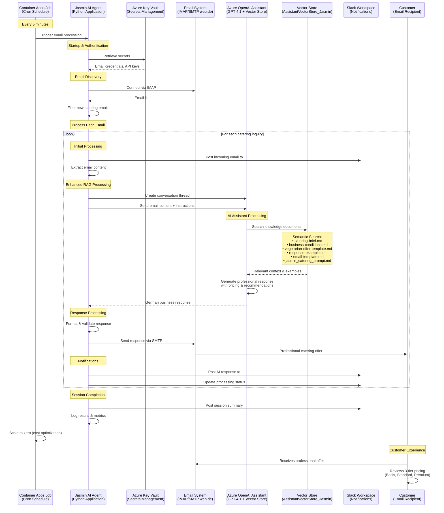

# Sequential Workflow Diagram

## Complete Email Processing Flow

## Key Processing Steps

### 1. **Automated Scheduling**
- Container Apps Job runs every 5 minutes via cron
- Scale-to-zero when idle for cost optimization

### 2. **Secure Authentication** 
- Azure Key Vault stores all sensitive credentials
- Managed identity for secure access

### 3. **Email Processing**
- IMAP connection to web.de email system
- Filters for catering-related inquiries
- Processes multiple emails in batch

### 4. **Enhanced RAG AI Processing**
- Azure OpenAI Assistant with GPT-4.1 model
- Vector Store searches through 6 knowledge documents
- Semantic search for relevant business context
- Generates professional German responses

### 5. **Professional Communication**
- SMTP delivery of detailed catering offers
- Three-tier pricing structure (Basis/Standard/Premium)
- Professional business formatting

### 6. **Real-time Monitoring**
- Slack notifications for all activities
- Separate channels for requests and responses
- Processing summaries and error handling

## Performance Metrics

- **Processing Time**: 9.93s average per email
- **Success Rate**: 100% (verified with 5 test cases)
- **Knowledge Documents**: 6 files in vector store
- **Cost**: $60-96/month (48% reduction from previous setup)
- **Availability**: 99.9% SLA with scale-to-zero optimization