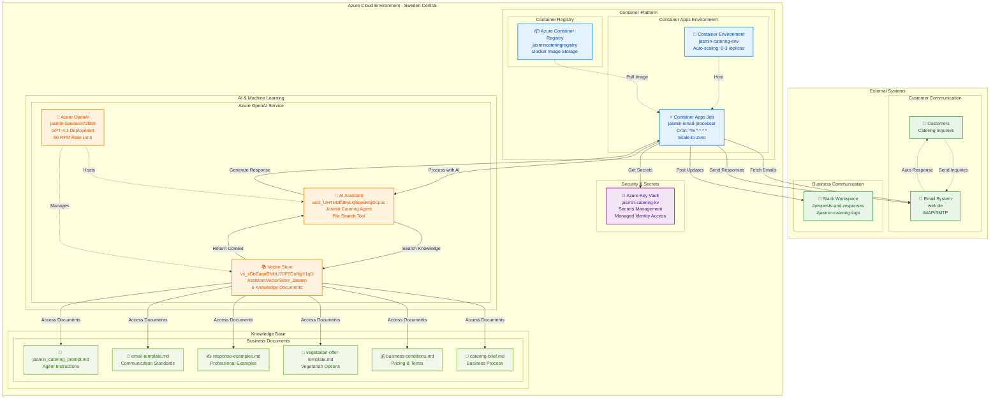
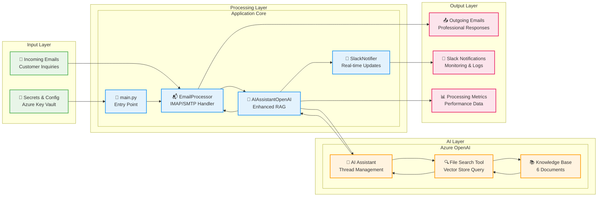

# System Architecture Diagrams

## Complete Cloud Architecture

## Data Flow Architecture

## Infrastructure Components

### 🏗️ Container Platform
- **Container Apps Job**: Scheduled execution every 5 minutes
- **Auto-scaling**: 0-3 replicas based on demand
- **Cost Optimization**: Scale-to-zero when idle

### 🤖 AI Services  
- **Azure OpenAI**: GPT-4.1 deployment with enhanced capabilities
- **AI Assistant**: Persistent context and conversation management
- **Vector Store**: Semantic search through business knowledge

### 🔐 Security
- **Managed Identity**: Secure service-to-service authentication
- **Key Vault**: Centralized secret management
- **Network Security**: VNet integration for production workloads

### 📊 Monitoring
- **Real-time Notifications**: Slack integration for all activities
- **Performance Metrics**: Processing time, success rates, token usage
- **Error Handling**: Comprehensive logging and alerting

## Cost Structure

| Component | Monthly Cost | Optimization |
|-----------|-------------|--------------|
| Container Apps Jobs | $2-8 | Scale-to-zero |
| Azure OpenAI | $50-80 | Pay-per-use tokens |
| Key Vault | $3 | Operation-based pricing |
| Container Registry | $5 | Minimal storage |
| **Total** | **$60-96** | **48% reduction** |

## Performance Characteristics

- **Latency**: 9.93s average processing time
- **Throughput**: 50 requests per minute
- **Availability**: 99.9% SLA target
- **Scalability**: Auto-scaling based on email volume
- **Reliability**: Retry logic and error handling