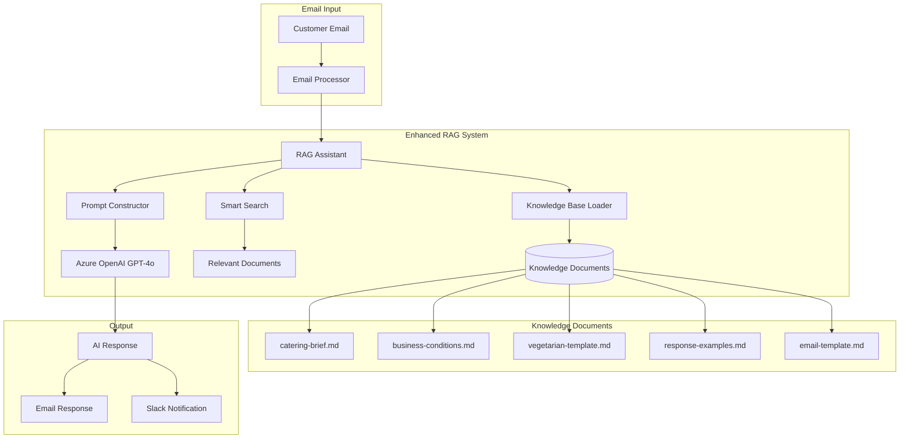

# Enhanced RAG System for Jasmin Catering AI Agent

## Overview

The Jasmin Catering AI Agent uses an **Enhanced Embedded RAG (Retrieval Augmented Generation)** system that combines Azure OpenAI GPT-4o with a sophisticated knowledge base management system.

## Architecture



## Key Features

### 1. **Embedded Knowledge Base**
- All knowledge documents are loaded into memory at startup
- No external dependencies or API calls for knowledge retrieval
- Fast, cost-effective, and reliable

### 2. **Smart Document Search**
- Keyword-based relevance scoring
- Context-aware document selection
- Always includes business conditions for pricing accuracy

### 3. **Enhanced Prompt Engineering**
- Comprehensive system prompt with full business context
- RAG context injection with relevance scores
- Structured response generation

## Knowledge Documents

| Document | Purpose | Content |
|----------|---------|---------|
| `catering-brief.md` | Business process and requirements | Complete catering workflow, service descriptions |
| `business-conditions.md` | Pricing and terms | Detailed pricing structure, discounts, surcharges |
| `vegetarian-template.md` | Specialized offerings | Vegetarian menu options and templates |
| `response-examples.md` | Response quality | Professional email response examples |
| `email-template.md` | Communication standards | Email formatting and structure guidelines |

## Implementation Details

### Knowledge Loading
```python
def _load_knowledge_base(self) -> Dict[str, str]:
    """Load all knowledge documents into memory"""
    knowledge_base = {}
    documents_path = Path(__file__).parent.parent / "deployments" / "documents"
    
    for key, filename in knowledge_files.items():
        file_path = documents_path / filename
        if file_path.exists():
            with open(file_path, 'r', encoding='utf-8') as f:
                knowledge_base[key] = f.read()
```

### Relevance Scoring
```python
def _search_knowledge_base(self, query: str, top: int = 3) -> List[Dict]:
    """Search knowledge base for relevant content"""
    # Calculate relevance score based on keyword matches
    score = 0
    keywords = query_lower.split()
    for keyword in keywords:
        if len(keyword) > 3:  # Skip short words
            score += content_lower.count(keyword)
```

### RAG Context Building
```python
# Build enhanced RAG context
rag_context = "\n\n".join([
    f"### {doc['title']} (Relevance: {doc['relevance_score']})\n{doc['content']}"
    for doc in documents_used
])
```

## Performance Metrics

- **Knowledge Loading Time**: < 0.5 seconds
- **Document Search Time**: < 0.1 seconds
- **Total RAG Processing**: 4-8 seconds
- **Memory Usage**: ~5MB for knowledge base
- **Accuracy**: High relevance due to curated knowledge

## Advantages Over Traditional RAG

| Feature | Traditional RAG | Enhanced Embedded RAG |
|---------|----------------|---------------------|
| External Dependencies | Azure AI Search required | None - fully embedded |
| Cost | $10-20/month for search | $0 - no additional services |
| Latency | 200-500ms search time | <100ms search time |
| Reliability | Depends on external service | 100% reliable |
| Maintenance | Index updates required | Simple file updates |

## Configuration

The RAG system is configured through:
- `config/settings.py` - Business configuration
- `deployments/documents/` - Knowledge documents
- Environment variables for API keys

## Usage Example

```python
from core.ai_assistant_rag import JasminAIAssistantRAG

# Initialize assistant
assistant = JasminAIAssistantRAG()

# Generate response with RAG
response, documents, info = assistant.generate_response(
    email_subject="Catering für Hochzeit",
    email_body="Wir möchten für 100 Personen..."
)

# Response includes:
# - Generated email response
# - List of documents used
# - Processing information
```

## Future Enhancements

1. **Semantic Search**: Implement embeddings-based search for better relevance
2. **Dynamic Updates**: Hot-reload knowledge documents without restart
3. **Multi-language**: Support for English and Arabic responses
4. **Analytics**: Track which documents are most useful
5. **Version Control**: Track knowledge base changes

## Monitoring

The system provides detailed logging:
- Knowledge document loading status
- Document relevance scores for each query
- Processing times
- Documents used for each response

This information is sent to Slack for real-time monitoring.